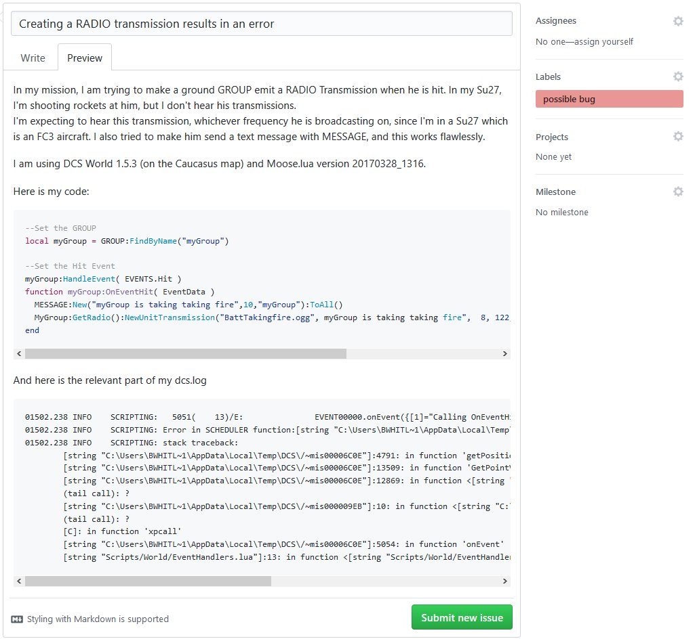

*** UNDER CONSTRUCTION ***

You are interrested in **testing the bleeding edge functionnalities** and features added by contributors every day, and you are **not afraid of bugs** that will inevitably crop up from time to time ? Then this page is for you ! You are going to learn :

1. How to set up your development environment
2. How is the Moose repository organized
3. How Moose is loaded in the missions and how this can make your workflow more efficient
4. How to use tools to process your .miz files efficiently
5. How Moose's release cycle work
6. How the Issue Tracker is managed

This might be a bit daunting at first, but the rewards in term of simplified workflow and direct access to new features is well worth the effort! If you have any problem during the setup or at any other point, don't hesitate to ask the [community](Communities) for help!

This guide assumes that **you already setup your development environment**, like a "normal" mission designer. Which means Lua Development Tools (LDT) is installed on your computer, and you already know how to create a mission using MOOSE. If it is not the case, please follow the instructions [here](http://flightcontrol-master.github.io/MOOSE/Usage_Guide.html) before proceeding.

# 1) Installation

## 1.1) Get your MOOSE repository installed on your PC and linked with GITHUB

### 1.1.1) Install GITHUB desktop

Install [GITHUB](https://desktop.github.com) desktop. 
Since the MOOSE code is evolving very rapidely between Releases, we store the MOOSE code on GitHub, and we use the GitHUb to sync it between the remote repository (the "origin") and your local MOOSE repository. That way, only one click is needed to update to the latest version of GitHub.

### 1.1.2) Link the MOOSE repository

Link the MOOSE repository on GITHUB to your freshly installed GITHUB desktop. 
This is done by browing to the [MOOSE repository at GITHUB](https://github.com/FlightControl-Master/MOOSE), and selecting the green button **Clone or Download** -> **Open in Desktop**.

Specify a local directory on your PC where you want to store the MOOSE repository contents.
Sync the MOOSE repository to a defined local MOOSE directory on your PC using GITHUB desktop (press the sync button).
You now have a copy of the code on computer, which you can update at any time by simply pressing the sync button.

### 1.2) Install 7-Zip

Install [7-Zip](http://www.7-zip.org/) if you don't already have it. It is a free and open source file archiver program. Since DCS' .miz files are simply renamed .zip files, 7-Zip is very usefull to manimulate them. We are providing the MOOSE testers and contributors with tools to batch process their .miz files, and they rely on 7-Zip. Keep the path to your 7-Zip installation handy, it will be use in the next step !

### 1.3) Run the Install script

Because DCS is going to load Moose dynamically (more on that later), we need to do some (slightly) advanced stuff to finish the setup of your own development enviroment. Thankfully we wrote a program to do it automatically for you !

Browse to your local MOOSE repository and run `Moose Development Environment Setup\MooseDevelopmentEnvironmentSetup.exe` **as an administrator** (Select the file > Right Click > Run as administrator). 

* The splash screen opens, click ok
* Enter (or browse for) the 3 paths asked and click ok. Don't worry about trailing backslashs.
* Let the program do its magic ! 
* When the program finishes, it will inform you that you need to restart your computer to use the .miz files management tools.

If you encounter a problem during this installation, please contact the [community](Communities), with the mdes.log file which was generated next to the executable file. We'll try our best to help you!

_Wait, I'm not running a program randomly found on the internet like that. I don't even know what it does, and why does it have to be run as an administartor anyway?!_
And you shouldn't. Here is the explanation of what this tool does (but the explanation is a bit technical, your are warned!):

* Create a hard link between your local repository and `DCSWorld/Scripts/`
* Add 7-Zip to your PATH environment variable (this explains the restart requirement)
* Copy a precompiled version of Lua 5.1 to your `Program Files` (this explains the administrator priviledge requirement)

The executable is made with AutoIt, its script is available near the executable. Open it as a text file if you want to know what it does. If you are still reluctant to do this, the whole process can be done manually by experienced users, get in touch with the [community](Communities)!

# 2) MOOSE Directory Structure

***TDOD : Update this section because of the repo changes***

The MOOSE framework is devided into a couple of directories:

* Moose Development: Contains the collection of lua files that define the MOOSE classes. You can use this directory to build the dynamic luadoc documentation intellisense in your eclipse development environment.
* Moose Mission Setup: Contains the Moose.lua file to be included in your scripts when using MOOSE classes (see below the point Mission Design with Moose).
* Moose Test Missions: Contains a directory structure with Moose Test Missions and examples. In each directory, you will find a miz file and a lua file containing the main mission script.
* Moose Training: Contains the documentation of Moose generated with luadoc from the Moose source code. The presentations used during the videos in my [youtube channel](https://www.youtube.com/channel/UCjrA9j5LQoWsG4SpS8i79Qg), are also to be found here.

# 3) Static Loading vs Dynamic Loading

## 3.1) Static Loading

**Moose static loading** is what the "normal" mission designer uses. Simply put, there **is a tool which concatenates every .lua file** which constitutes Moose **into just one: Moose.lua**. This is the file which is loaded in Mission Editorr by the mission designer.
This process is very useful **when you are using a stable Release** of Moose which don't change often, because it is really easy to set up for the mission designer. It also allows him to **release missions** which are contained in their entirety in the .miz file.
But in a context in wich Moose changes often, static loading would require the generation of a new Moose.lua for every change and the replacement the old Moose.lua in the .miz file you are using to test the changes. Add to this cumbersome process the fact that the Mission Editor doesn't like changes to the .miz file while it is open, which means you would need to close and reopen the Mission Editor for every change, and this process becomes unworkable for both the tester and the contributor.

## 3.2) Dynamic Loading

Enter **Moose Dynamic loading**. In this process, the **Moose.lua** you insert in your .miz file **looks for every .lua** which constitute Moose in `DCSWorld\Scripts`, **and asks DCS to load them** during the mission startup. This way, the latest changes to Moose's .lua files in `DCSWorld\Scripts` are automatically taken into account when you restart the mission, no need to fiddle around with the .miz file or to close the mission editor!
Now, there is still a problem left : you wouldn't want to have to copy the Moose's .lua files from your local repository to `DCSWorld\Scripts` everytime you retrieve a new version of Moose. The solution to this problem is a dynamic link! It is created by the Install Scipt (see above), and, simply put, makes sure that the folder `DCSWorld\Scripts\Moose` is always in sync with your local repository. That way, **everytime you want to update to the next Moose, you simply sync your local repository** with the remote with GitHub, **and restart your mission** !
Note that if you want to **release your missions to end users**, you will need to make it **use the static loading process**. There is a tool to automate this task, read below.

# 4) Tools to help you manage your .miz files

***TODO : Add a list of the .miz files tools a briefly explain their usages***

# 5) The release cycle

To ensure that the next Release of Moose is as bug-free and feature rich as possible, every Moose contributor respects a release cycle. 

If you are not familiar with Git, this might be a bit criptic, but the idea behind it is simple : 

* Most of the time, contributors write code, be it features or bug fixes, and the testers report bugs.
* When a good amount of features are added to the last release, FlightControl decides to enter in a "Feature Freeze" period. **No new features are added** during this period (but they can still be worked on), and **every bug must be eliminated**. That is the period during which bug reports are paramount!
* Now that this version of **Moose is stable**, we can release it for every mission designer, and go back to the start for the next cycle.

# 6) The Issue Tracker

## 6.1) How to report a bug ?

If you **encounter** what seem to be a **bug**, which is bound to happen sooner or later since you are testing the brand new untested features of Moose, you will want to **report it** so that it can be solved by the contributors. We use the standard GitHub [Issue Tracker](https://github.com/FlightControl-Master/MOOSE/issues). Here is the process to create a new issue :

* First, do a quick **search on the issue tracker** to see if someone hasn't already reported your issue. If it is the case, comment on this issue that you are able to reproduce it, and add the informations listed below.
* **Create a new issue**.
* **Add the information** listed below
* Add the **lablel possible bug**
* Thank you for helping us make Moose better!

**_Informations we need to solve the issue_**

* **A descriptive title**, not too long if possible. For exemple, `CTD when calling SPAWN:New()` is a good title. `I found a bug in MOOSE` is not.
* Explain **what you are trying to do**, as well as **how you expect Moose to be behave**.
* Which **version of Moose** and DCS World you are using. This can be found in `dcs.log`
* Did the code you are using worked in previous version of either DCS World or Moose? Which one?
* The **code** or portion of code **that triggered the problem**. Please put  **_\`\`\`lua_**  one line before your code, and  **_\`\`\`_**  at the end, to make your code readable.
* The relevant part of **`dcs.log`**. Please put **_\`\`\`_** before and after your copy-pasted log to make it readable.

## 6.2) How to add a feature request ?

* **A descriptive title**, not too long if possible.
* Explain in detail **what you want Moose to do** in which circonstance.
* If possible, add some pseudocode or a high level design implementation to better explain how your feature would work.
* Add the **lablel enhancment**

## 6.3) The life and death of an issue

**_What is going to happen next to my issue?_**

* A contributor will set some labels and a milestone to your issue, in order to classify it.
* You might be asked to clarify some part of your issue, please answer as swiftly as possible.
* You might be asked to sync your local repository and try again, if we think we fixed your issue. If we can confirm it to be fixed the issue is closed.

**_Wait, my issue was closed, and it never got fixed ! / Nobody is paying attention to it !_** 

This can happen for multiple reasons :

* Your issue is a duplicate. (There is alredy a issue in our issue tracker for this)
* Nobody was able to reproduce your bug, so we think it's a problem on your end
* Your feature request asks for a feature that already exists
* We think your feature request is a really good idea, but it's a huge time commitment. We therefore postponed it to the Realease after the next one, or to a later Release.
* We are working hard and simply don't have the time. We will get around to check your issue, please be patient!
