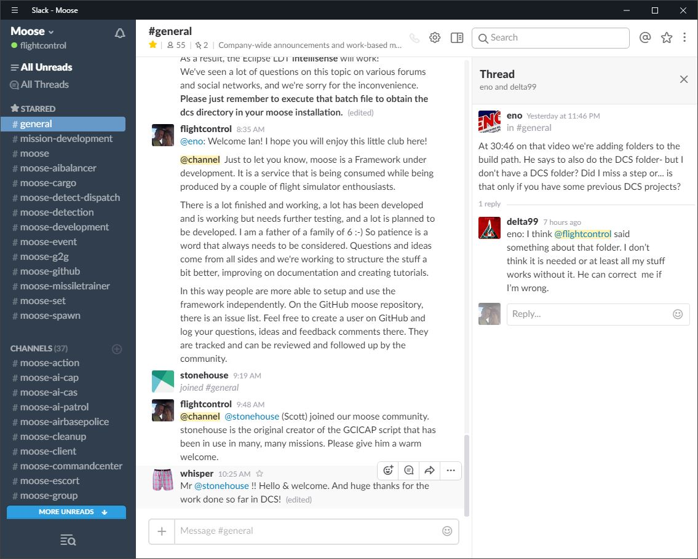

# 1) MOOSE framework support channels

MOOSE is broadcasted, documented and supported through various social media channels.

## 1.1) MOOSE broadcast channels on YouTube

MOOSE has a [broadcast channel](https://www.youtube.com/channel/UCjrA9j5LQoWsG4SpS8i79Qg/playlists) on youtube. 
These videos are grouped into playlists, which explain specific MOOSE capabilities, 
and gradually build up the "understanding" and "what is possible" to do with the MOOSE framework.
I really, really encourage all to watch the explanation videos.

Some mandatory videos to watch are:

  * [MOOSE Introduction](https://www.youtube.com/playlist?list=PL7ZUrU4zZUl1JEtVcyf9sazUV5_fGICz4)

  * [MOOSE Setup](https://www.youtube.com/watch?v=-Hxae3mTCE8&t=159s&index=1&list=PL7ZUrU4zZUl0riB9ULVh-bZvFlw1_Wym2)
  * [MOOSE Spawning](https://www.youtube.com/playlist?list=PL7ZUrU4zZUl1jirWIo4t4YxqN-HxjqRkL)
  * [MOOSE Tasking](https://www.youtube.com/playlist?list=PL7ZUrU4zZUl3CgxN2iAViiGLTPpQ-Ajdg)
  * [MOOSE Task Dispatching](https://www.youtube.com/playlist?list=PL7ZUrU4zZUl3I6ieFM-cjey-rncF1ktNI)

## 1.2) MOOSE on Eagle Dynamics forums

This is a default thread at the Eagle Dynamics forums where the MOOSE framework can be discussed and supported.
The thread is called [MOOSE - Mission Object Oriented Scripting Framework](https://forums.eagle.ru/showthread.php?t=138043).

## 1.3) MOOSE on GITHUB.

I encourage that you create also a user at GITHUB.
On the MOOSE framework GITHUB site, you can register issues, feedback and comments in the issues section of the site.
This allows to track this feedback and issues, in order to provide a structured support and create a milestone plan.
In other words, treat this development as a project.

## 1.4) MOOSE on slack.com

Slack is a team community site. It is a great environment to discuss online the framework.
Various channels are allocated in the environment to discuss specific topics. 
A channel exists per MOOSE class, so that a focused discuss is possible.

