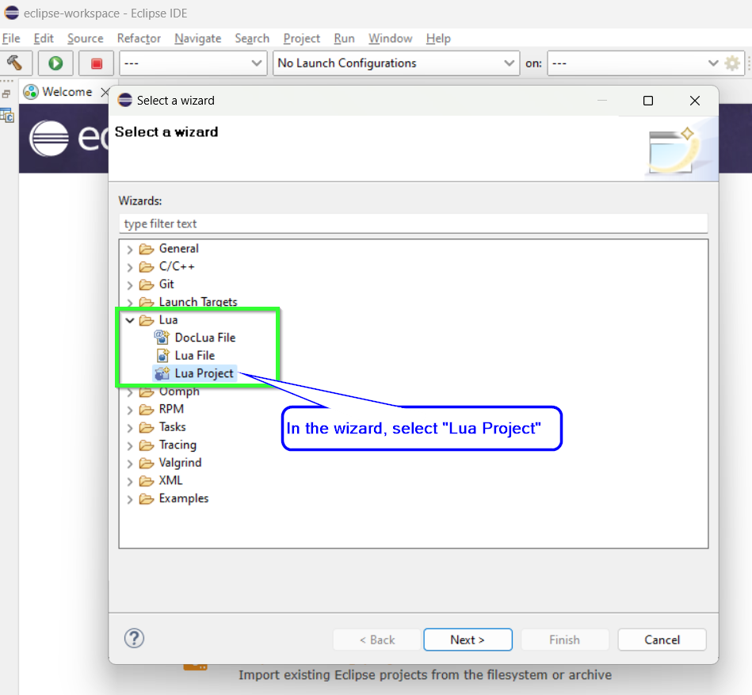

# Eclipse Installation
{: .no_toc }

1. Table of contents
{:toc}

This guide describes how to install [Eclipse] and install the necessary [Lua]
environment.

{: .note }
> Note that the [Lua] environment is not actively supported any more
> by Oracle. Especially the LDT plugin is not working when installed from the
> market place. The problem and solution is nicely described [in this topic].

## Prerequisites

* Download Eclipse from [eclipse.org].
* Download [dltk-core].
* Download or clone [MOOSE repository] (select branch you want `master` or `develop`).

## Install Eclipse

First you need to install [Eclipse]. It will ask you what kind of environment
you use, *e.g.* C++ or Java or something else. This does not really matter since
we want to use it for Lua and need to install the plugin for [Lua] later.

## Install dltk-core

Before you can install the LDT plugin, you first need to add dltk-core zip file
to the available software sites. Open eclipse, go to the help menu and follow
the steps in the image:

This should then be in the available software sites.

## Install LDT Plugin
Open eclipse and from the "Help" menu open the "Eclipse Marketplase":

In the "Search" tab find "lua" and install the "Lua Development Tools 1.4.x":

## Setup Lua Project for MOOSE
Now that Eclipse and LDT are installed, we need to add MOOSE as a LUA project.
Open Eclipse and from the "File" menu select "Other":

In the wizard window that opens select "Lua Project":

Setup the Lua project as described in the image. You need to specify the path to
where you downloaded the MOOSE repository:

From the "Project" tab select "Properties" and add `Moose/Moose Development/Moose`
to the build path as shown below:

## Finally
Now you are done!
Check that your script explorer looks like in the image below and that the
intellisense is working when you open a MOOSE file:

[Eclipse]: https://www.eclipse.org
[Lua]: https://www.lua.org/
[eclipse.org]: https://www.eclipse.org/downloads/
[dltk-core]: https://www.eclipse.org/downloads/download.php?file=/technology/dltk/downloads/drops/R5.7/R-5.7.1-201703020501/dltk-core-R-5.7.1-201703020501.zip
[MOOSE repository]: https://github.com/FlightControl-Master/MOOSE/
[in this topic]: https://www.eclipse.org/forums/index.php/t/1101907/