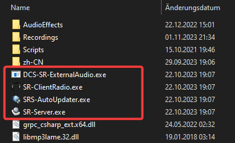
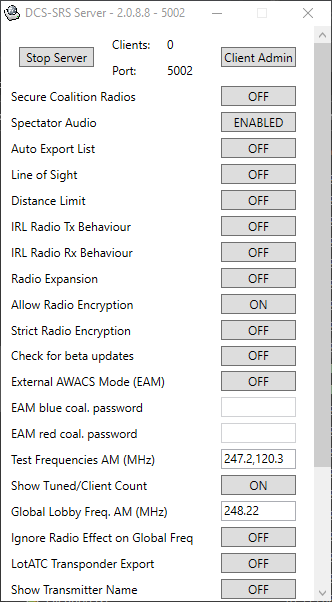
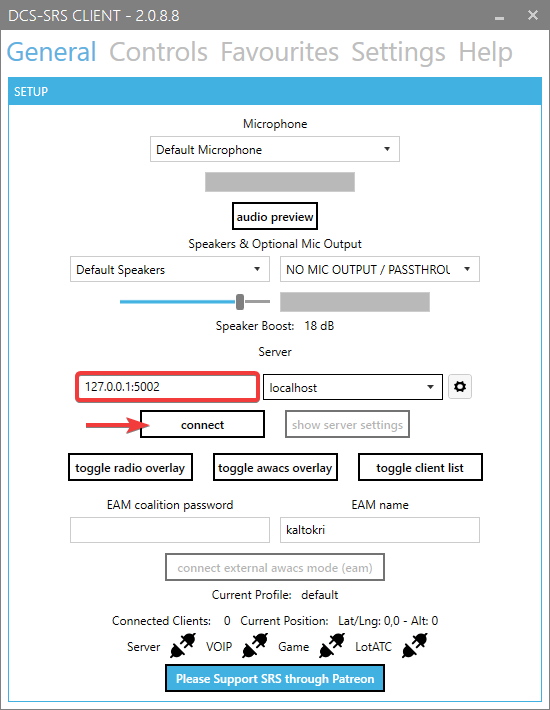
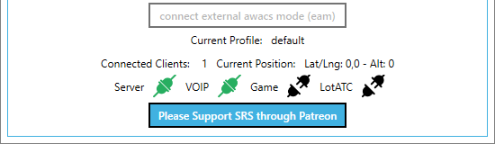
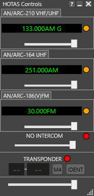
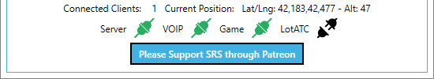
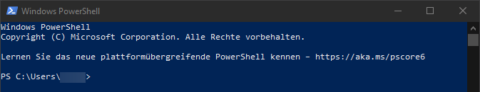
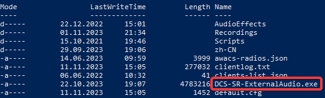
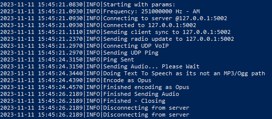

# Text to Speech
{: .no_toc }

1. Table of contents
{:toc}

This guide describes how to configure and use [Text-To-Speech{:target="_blank"}
(or TTS) with MOOSE. We use [DCS Simple Radio Standalone] (DCS-SRS) to generate
the audio and send it to the client. SRS is a well known VOIP client simulating
a radio in DCS.

{: .note }
> Only clients which uses SRS are able to hear the generated radio calls.
> This is not compatible with the in game VOIP audio system from Eagle Dynamics!

## Prerequisites

- Download and install [DCS Simple Radio Standalone]{:target="_blank"} (DCS-SRS).
- Use a good text editor like [Notepad++]{:target="_blank"}.
- Create a simple test mission with Moose included and a "... from parking hot"
  airplane or helicopter.
- [De-Sanitize the DCS scripting environment].

## Start SR-Server and connect the client

- Navigate to the install directory of SRS.
    - As default it should be located here: `C:\Program Files\DCS-SimpleRadio-Standalone`

- We are interested in the executable files:

    

- Start the server by double click on `SR-Server.exe`. 
  It should looks like this:

    

- Start the `SR-ClientRadio.exe`.

- Connect to the local server:
  - Use the port shown in the server window (default is 5002).
  - Use the ip of the windows loopback device (which is 127.0.0.1).
  - Example: `127.0.0.1:5002`

    

- If asked if you want to allow changes to your PC, say yes.

- After you clicked on Connect and some seconds the status should look like this:

    

- Your server UI now shows 1 connected client.

- Click on „toggle radio overlay“ on the client. A small grey window will pop-up.

## Start DCS World and your test mission

- Jump into a plane or helicopter.

- The connection status on the client UI and overlay should be changing
  and shows the available radios of the module and it's frequencies:

    

- The third green connector on the client UI should be green now:

    

## Command line test with Power Shell

- Use the search icon in windows to locate and start `PowerShell`, you’ll get a
  blue terminal window:

    

- Now navigate in PowerShell to the SRS install folderwith the following command:

    `cd 'C:\Program Files\DCS-SimpleRadio-Standalone\'`

    {: .note }
    > Change the path if you choose another installation directory for SRS.

- Type `dir` and press enter to get a listing of all files in the directory.
  - `DCS-SR-ExternalAudio.exe` should be amongst them.

    

- Now we are going to create a text-to-speech command which should be sent to
  the radio on your airplane or helicopter.
  - The parameter `-t` will define the text to send.
  - The frequency will be defined with `-f`. Adopt it to match the frequency of
    your airplane or helicopter! For example 251.
  - And the modulation is set by `-m`. For example AM.
  - Define the coalition with `-c`. 0 is Spectator, 1 is Red, 2 is Blue.

    `.\DCS-SR-ExternalAudio.exe -t "Hello Moosers" -f 251 -m AM -c 2`

  - The console output should look like this:

    

**If you can hear the voice on the cockpit radio, you are done!**

If you get UpnP/Network errors, you need to allow DCS-SR-ExternalAudio.exe to
traverse your firewall.

{: .note }
> You can raun `DCS-SR-ExternalAudio.exe` without any parameters to get help.

## Firewall Setup

- On Windows search, type Firewall and open „Firewall- and Network Protection“.
  Click on „Extended Setting“ (you need admin rights to do that).

- You will need two incoming and two outgoing rules (4 overall), right-click on
  incoming/outgoing rules to create new rules.

- Give the rule a nice name:

- Protocols and Services – you need to create ONE rule for TCP and another one
  for UDP. Select TCP from the drop down:

- On Programs and Services, enable 'this program' and use search to locate and
  select DCS-SR-ExternalAudio.exe:

- Click „ok“ to save and close the rule.

- Repeat for UDP.

- Repeat twice for outgoing, one for TCP and one for UDP.

- You’re done and can return to 'Command line test'.

## Google TTS

- For Google TTS you need to have a Google Cloud Account (a testing one will do).

- You can start here: <https://cloud.google.com/text-to-speech/>

- You need to create a projekt and enable the 'Cloud Text-To-Speech API' in it.

- You also need to create a service-account and create a `.json` key file for it.

There’s a lot of supporting information on the Google Cloud Site to help you
with that. Similar to 'Command line test', you can test your setup on the
command line. Here is an example that assumed your .json key file resides in the
SRS directory:

`.\DCS-SR-ExternalAudio.exe -t "Hello Moosers" -f 251 -m AM -c 2 -z -G .\yourgoogleaccount.json`

[Text-To-Speech]: https://en.wikipedia.org/wiki/Speech_synthesis
[DCS Simple Radio Standalone]: https://github.com/ciribob/DCS-SimpleRadioStandalone/releases/latest
[De-Sanitize the DCS scripting environment]: desanitize-dcs.md
[Notepad++]: https://notepad-plus-plus.org/downloads/
