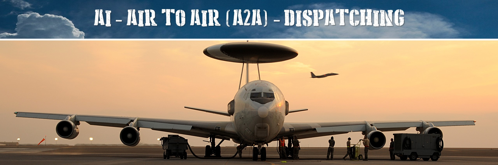
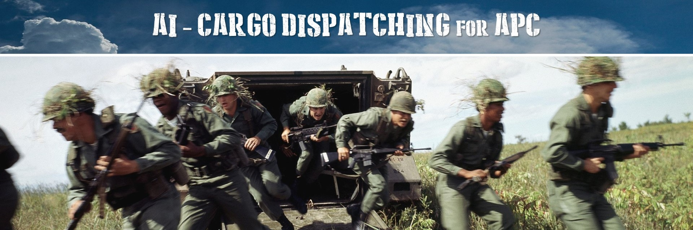
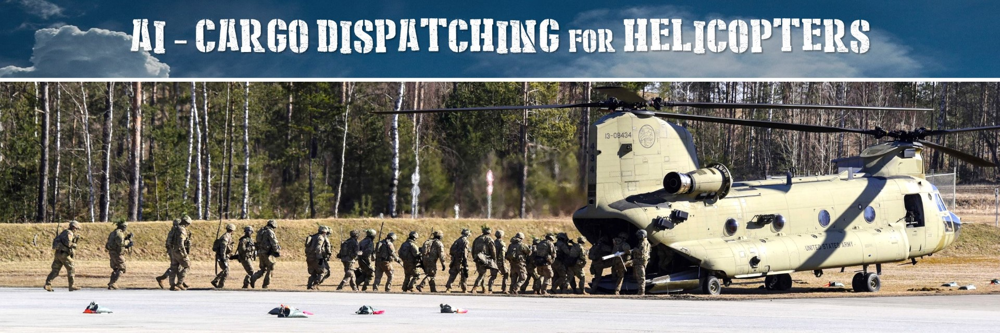
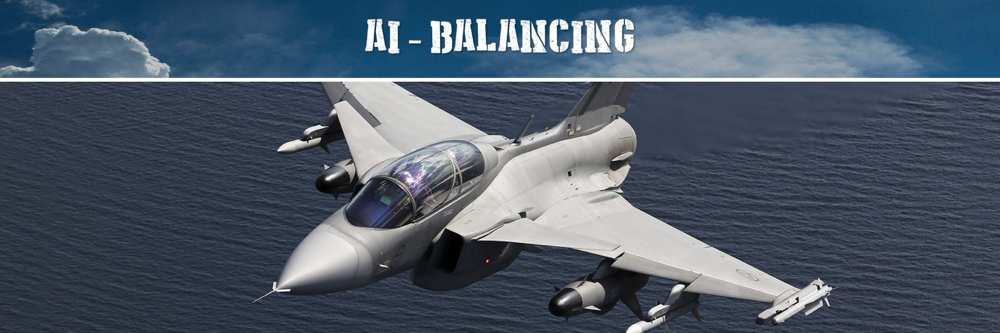
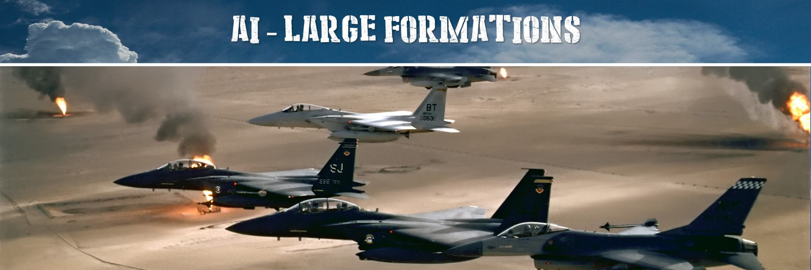
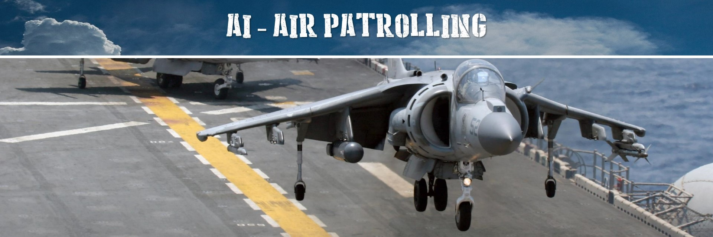
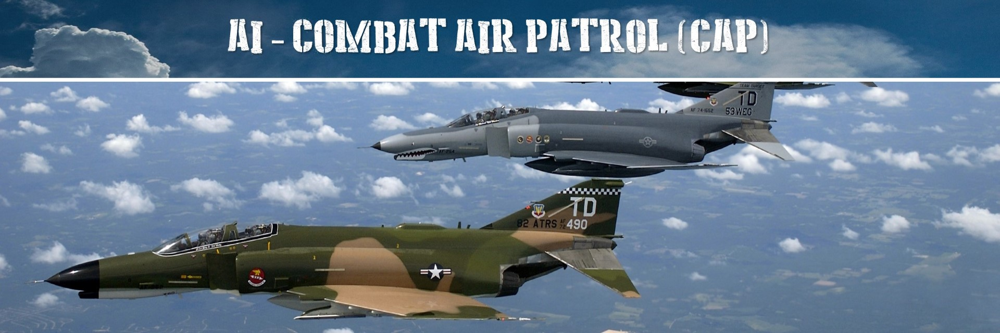
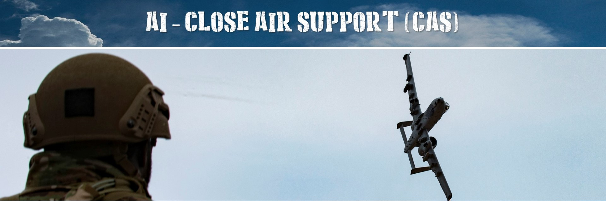
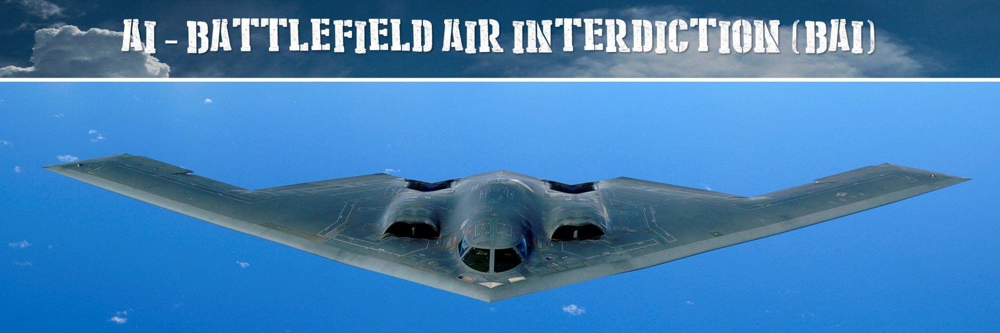

# AI classes guide

## 1. A2A Dispatching

### 1.1. [AI A2A Dispatcher]

Create an **A2A defense system** executed by AI to perform CAP or GCI to defend your airspace.
There are two classes that are important to learn:

   * [AI_A2A_GCICAP]
   * [AI_A2A_DISPATCHER]
   
The [AI_A2A_GCICAP] is a class for **novice mission designers**,
so I recommend novice users to start with using this class.
You can quickly configure a working GCICAP process.
But it will provide less flexibility and options.
If you want more options, use the [AI_A2A_DISPATCHER].

**Features:**
 
  * Setup quickly an A2A defense system for a coalition.
  * Setup (CAP) Control Air Patrols at defined zones to enhance your A2A defenses.
  * Setup (GCI) Ground Control Intercept at defined airbases to enhance your A2A defenses.
  * Define and use an EWR (Early Warning Radar) network.
  * Define squadrons at airbases.
  * Enable airbases for A2A defenses.
  * Add different plane types to different squadrons.
  * Add multiple squadrons to different airbases.
  * Define different ranges to engage upon intruders.
  * Establish an automatic in air refuel process for CAP using refuel tankers.
  * Setup default settings for all squadrons and A2A defenses.
  * Setup specific settings for specific squadrons.
  * Quickly setup an A2A defense system using AI_A2A_GCICAP.
  * Setup a more advanced defense system using AI_A2A_DISPATCHER.

## 2. AI Cargo Dispatching

Cargo dispatching will make the AI to transport cargo to deploy zones.
Cargo can be transported by APC or trucks, or by helicopters.

**Overall Features:**

  * Quickly transport cargo to various deploy zones using different carrier types.
  * Various cargo types can be transported. These are infantry groups and crates.
  * Define a list of deploy zones of various types to transport the cargo to.
  * Multiple carrier groups can be enabled as one collaborating transportation process.
  * Different options can be setup to tweak the cargo transporation behaviour.
  * Home location that will be used for carrier parking, when all cargo has been transported.
  * Automatic activation of carriers when new cargo is to be picked-up (of cargo is spawned for example).

### 2.1. [AI Cargo Dispatching for APC]

Models the intelligent transportation of infantry and other cargo using **APCs or trucks**.

**Specific Features:**

  * The vehicles follow the roads to ensure the fastest possible cargo transportation over the ground.
  * Multiple vehicles can transport multiple cargo as one vehicle group.
  * Infantry loaded as cargo, will unboard in case enemies are nearby and will help defending the vehicles.
  * Different ranges can be setup for enemy defenses.

### 2.2. [AI Cargo Dispatching for Helicopters]

Models the intelligent transportation of infantry and other cargo using **Helicopters**.

**Specific Features:**

  * The helicopters will fly towards the pickup locations to pickup the cargo.
  * The helicopters will fly towards the deploy zones to deploy the cargo.
  * Precision deployment as well as randomized deployment within the deploy zones are possible.
  * Helicopters will orbit the deploy zones when there is no space for landing until the deploy zone is free.

## 3. [AI Balancing]

Balance player slots with AI to create an engaging simulation environment, independent of the amount of players.

**Features:**

  * Automatically spawn AI as a replacement of free player slots for a coalition.
  * Make the AI to perform tasks.
  * Define a maximum amount of AI to be active at the same time.
  * Configure the behaviour of AI when a human joins a slot for which an AI is active.

## 4. [AI Large Formations]

Build large airborne formations of aircraft.

**Features:**

  * Build in-air formations consisting of more than 40 aircraft as one group.
  * Build different formation types.
  * Assign a group leader that will guide the large formation path.

## 5. AI engagement

### 5.1. [AI Patrolling]

Peform Air Patrolling for airplanes within a patrol zone.

**Features:**

  * Patrol AI airplanes within a given zone.
  * Trigger detected events when enemy airplanes are detected.
  * Manage a fuel treshold to RTB on time.

### 5.2. [AI Combat Air Patrolling]

Peform Combat Air Patrolling (CAP) for airplanes within a patrol zone.

**Features:**

  * Patrol AI airplanes within a given zone.
  * Trigger detected events when enemy airplanes are detected.
  * Manage a fuel treshold to RTB on time.
  * Engage the enemy when detected.

### 5.3. [AI Close Air Support]

Peform Close Air Support (CAS) near friendlies within an engagement zone.

**Features:**
 
  * Hold and standby within a patrol zone.
  * Engage upon command the enemies within an engagement zone.
  * Loop the zone until all enemies are eliminated.
  * Trigger different events upon the results achieved.
  * After combat, return to the patrol zone and hold.
  * RTB when commanded or after out of fuel.

### 5.4. [AI Battlefield Air Interdiction]

Peform Battlefield Air Interdiction (BAI) within an engagement zone.

**Features:**
 
  * Hold and standby within a patrol zone.
  * Engage upon command the assigned targets within an engagement zone.
  * Loop the zone until all targets are eliminated.
  * Trigger different events upon the results achieved.
  * After combat, return to the patrol zone and hold.
  * RTB when commanded or after out of fuel.

[AI A2A Dispatcher]: https://flightcontrol-master.github.io/MOOSE_DOCS_DEVELOP/Documentation/AI.AI_A2A_Dispatcher.html
[AI_A2A_GCICAP]: https://flightcontrol-master.github.io/MOOSE_DOCS_DEVELOP/Documentation/AI.AI_A2A_Dispatcher.html#AI_A2A_GCICAP
[AI_A2A_DISPATCHER]: https://flightcontrol-master.github.io/MOOSE_DOCS_DEVELOP/Documentation/AI.AI_A2A_Dispatcher.html#AI_A2A_DISPATCHER
[AI Cargo Dispatching for APC]: https://flightcontrol-master.github.io/MOOSE_DOCS_DEVELOP/Documentation/AI.AI_Cargo_Dispatcher_APC.html
[AI Cargo Dispatching for Helicopters]: https://flightcontrol-master.github.io/MOOSE_DOCS_DEVELOP/Documentation/AI.AI_Cargo_Dispatcher_Helicopter.html
[AI Balancing]: https://flightcontrol-master.github.io/MOOSE_DOCS_DEVELOP/Documentation/AI.AI_Balancer.html
[AI Large Formations]: https://flightcontrol-master.github.io/MOOSE_DOCS_DEVELOP/Documentation/AI.AI_Formation.html
[AI Patrolling]: https://flightcontrol-master.github.io/MOOSE_DOCS_DEVELOP/Documentation/AI.AI_Patrol.html
[AI Combat Air Patrolling]: https://flightcontrol-master.github.io/MOOSE_DOCS_DEVELOP/Documentation/AI.AI_CAP.html
[AI Close Air Support]: https://flightcontrol-master.github.io/MOOSE_DOCS_DEVELOP/Documentation/AI.AI_CAS.html
[AI Battlefield Air Interdiction]: https://flightcontrol-master.github.io/MOOSE_DOCS_DEVELOP/Documentation/AI.AI_BAI.html
[AI Patrolling]: https://flightcontrol-master.github.io/MOOSE_DOCS_DEVELOP/Documentation/AI.AI_Patrol.html
