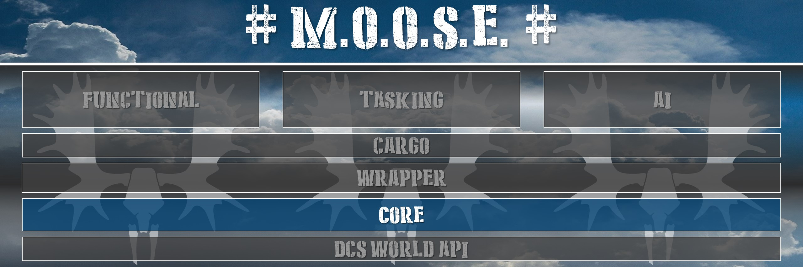
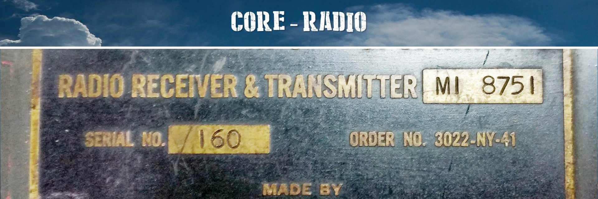

# Core classes guide

This chapter lists the core classes, which enhance existing DCS capabilities, and are used throughout the framework.
Mission designers can use these core classes to enhance their scripting.

## 1. [BASE](https://flightcontrol-master.github.io/MOOSE_DOCS_DEVELOP/Documentation/Core.Base.html)

Wraps the DCS _Group_ objects.

**Features:**

  * The construction and inheritance of MOOSE classes.
  * The class naming and numbering system.
  * The class hierarchy search system.
  * The tracing of information or objects during mission execution for debuggin purposes.
  * The subscription to DCS events for event handling in MOOSE objects.
  * Object inspection.

**Remember, everything in moose derives from the BASe class.**

## 2. [DATABASE](https://flightcontrol-master.github.io/MOOSE_DOCS_DEVELOP/Documentation/Core.Database.html)

Manages several databases containing templates, mission objects, and mission information.

**Features:**

  * During mission startup, scan the mission environment, and create / instantiate intelligently the different objects as defined within the mission.
  * Manage database of DCS Group templates (as modelled using the mission editor).
    - Group templates.
    - Unit templates.
    - Statics templates.
  * Manage database of [Wrapper.Group] objects alive in the mission.
  * Manage database of [Wrapper.Unit] objects alive in the mission.
  * Manage database of [Wrapper.Static] objects alive in the mission.
  * Manage database of players.
  * Manage database of client slots defined using the mission editor.
  * Manage database of airbases on the map, and from FARPs and ships as defined using the mission editor.
  * Manage database of countries.
  * Manage database of zone names.
  * Manage database of hits to units and statics.
  * Manage database of destroys of units and statics.
  * Manage database of [Core.Zone] objects.

**These database contain all objects, you can filter these objects using sets.**

## 3. [EVENT](https://flightcontrol-master.github.io/MOOSE_DOCS_DEVELOP/Documentation/Core.Event.html)

 Models DCS event dispatching using a publish-subscribe model.

**Features:**

  * Capture DCS events and dispatch them to the subscribed objects.
  * Generate DCS events to the subscribed objects from within the code.
 
**Learn the event handling system, it will make your life much more easier while designing missions.**

## 4. [FSM](https://flightcontrol-master.github.io/MOOSE_DOCS_DEVELOP/Documentation/Core.Fsm.html)

FSM (Finite State Machine) are objects that model and control long lasting business processes and workflow.

**Features:**

  * Provide a base class to model your own state machines.
  * Trigger events synchronously.
  * Trigger events asynchronously.
  * Handle events before or after the event was triggered.
  * Handle state transitions as a result of event before and after the state change.
  * For internal moose purposes, further state machines have been designed:
    - to handle controllables (groups and units).
    - to handle tasks.
    - to handle processes.
**Finite State Machines are a great asset within moose, it is used everywhere to create dynamic workflows!**

## 5. [GOAL](https://flightcontrol-master.github.io/MOOSE_DOCS_DEVELOP/Documentation/Core.Goal.html)

Models the process to achieve Goal(s). Derived classes implement the ways how the achievements can be realized.

**Features:**

  * Define the goal.
  * Monitor the goal achievement.
  * Manage goal contribution by players.

**Define goals to provide your players with a challenge.**

## 6. [MENU](https://flightcontrol-master.github.io/MOOSE_DOCS_DEVELOP/Documentation/Core.Menu.html)

Manage hierarchical menu structures and commands for players within a mission.
The advantage of using menu classes is that it hides the complexity of dealing with menu management in more advanced
scanerios where you need to set menus and later remove them, and later set them again. You'll find while using use
normal DCS scripting functions, that setting and removing menus is not a easy feat if you have complex menu hierarchies
defined. Using the moose menu classes, the removal and refreshing of menus are nicely being handled within these
classes, and becomes much more easy. On top, moose implements variable parameter passing for command menus, which can
be updated without having to touch the menus.

**Features:**

  * Setup mission sub menus.
  * Setup mission command menus.
  * Setup coalition sub menus.
  * Setup coalition command menus.
  * Setup group sub menus.
  * Setup group command menus.
  * Manage menu creation intelligently, avoid double menu creation.
  * Only create or delete menus when required, and keep existing menus persistent.
  * Update menu structures.
  * Refresh menu structures intelligently, based on a time stamp of updates.
    - Delete obscolete menus.
    - Create new one where required.
    - Don't touch the existing ones.
  * Provide a variable amount of parameters to menus.
  * Update the parameters and the receiving methods, without updating the menu within DCS!
  * Provide a great performance boost in menu management.
  * Provide a great tool to manage menus in your code.

**Learn the menu system, it has some great hidden features.**

## 7. [MESSAGE](https://flightcontrol-master.github.io/MOOSE_DOCS_DEVELOP/Documentation/Core.Message.html)

Informs the players using messages during a simulation.

**Features:**

  * A more advanced messaging system using the DCS message system.
  * Time messages.
  * Send messages based on a message type, which has a pre-defined duration that can be tweaked in SETTINGS.
  * Send message to all players.
  * Send messages to a coalition.
  * Send messages to a specific group.

**The message system really helps with the communication to your players.**

## 8. [POINT](https://flightcontrol-master.github.io/MOOSE_DOCS_DEVELOP/Documentation/Core.Point.html)

Defines an extensive API to manage 3D points in the DCS World 3D simulation space.

**Features:**

  * Provides a COORDINATE class, which allows to manage points in 3D space and perform various operations on it.
  * Provides a POINT_VEC2 class, which is derived from COORDINATE, and allows to manage points in 3D space, but from a
    Lat/Lon and Altitude perspective.
  * Provides a POINT_VEC3 class, which is derived from COORDINATE, and allows to manage points in 3D space, but from a
    X, Z and Y vector perspective.

**The coordinate system classes are essential to understand. Learn this!**

## 9. [RADIO](https://flightcontrol-master.github.io/MOOSE_DOCS_DEVELOP/Documentation/Sound.Radio.html)

Is responsible for everything that is related to radio transmission and you can hear in DCS, be it TACAN beacons, Radio
transmissions.

**Features:**

  * Provide radio functionality to broadcast radio transmissions.
  * Provide beacon functionality to assist pilots.

**Radio and beacons really enhance game experience for hardened and experienced players and pilots!**

## 10. [REPORT](https://flightcontrol-master.github.io/MOOSE_DOCS_DEVELOP/Documentation/Core.Report.html)

Provides a handy means to create messages and reports. This class is extensively used in the tasking mechanism.

**Features:**

  * Create text blocks that are formatted.
  * Create automatic indents.
  * Variate the delimiters between reporting lines.

**Reports are used extensively in moose. Learn it and your messages get structure.**

## 11. [SCHEDULER](https://flightcontrol-master.github.io/MOOSE_DOCS_DEVELOP/Documentation/Core.Scheduler.html)

Prepares and handles the execution of functions over scheduled time (intervals).

**Features:**

  * Schedule functions over time,
  * optionally in an optional specified time interval, 
  * optionally **repeating** with a specified time repeat interval, 
  * optionally **randomizing** with a specified time interval randomization factor, 
  * optionally **stop** the repeating after a specified time interval. 

**Scheduler is key to control time and timed events.**
**When you lean how to schedule functions, you will be in control of your mission.**

## 12. [SET](https://flightcontrol-master.github.io/MOOSE_DOCS_DEVELOP/Documentation/Core.Set.html)

Define collections of objects to perform bulk actions and logically group objects.

**Features:**

  * Dynamically maintain collections of objects.
  * Manually modify the collection, by adding or removing objects.
  * Collections of different types.
  * Validate the presence of objects in the collection.
  * Perform bulk actions on collection.

**Collections are essential to control the objects and data in your missions efficiently.**

## 13. [SETTINGS](https://flightcontrol-master.github.io/MOOSE_DOCS_DEVELOP/Documentation/Core.Settings.html)

Manages various settings for running missions, consumed by moose classes and provides a menu system for players to tweak
settings in running missions.

**Features:**

  * Provide a settings menu system to the players.
  * Provide a player settings menu and an overall mission settings menu.
  * Mission settings provide default settings, while player settings override mission settings.
  * Provide a menu to select between different coordinate formats for A2G coordinates.
  * Provide a menu to select between different coordinate formats for A2A coordinates.
  * Provide a menu to select between different message time duration options.
  * Provide a menu to select between different metric systems.

**Settings can really enhance game play, especially for non-europeans :-)**

## 14. [SPAWN](https://flightcontrol-master.github.io/MOOSE_DOCS_DEVELOP/Documentation/Core.Spawn.html)

Spawn dynamically new groups of units in running missions.

**Features:**

  * Spawn new groups in running missions.
  * Schedule spawning of new groups.
  * Put limits on the amount of groups that can be spawned, and the amount of units that can be alive at the same time.
  * Randomize the spawning location between different zones.
  * Randomize the intial positions within the zones.
  * Spawn in array formation.
  * Spawn uncontrolled (for planes or helos only).
  * Clean up inactive helicopters that "crashed".
  * Place a hook to capture a spawn event, and tailor with customer code.
  * Spawn late activated.
  * Spawn with or without an initial delay.
  * Respawn after landing, on the runway or at the ramp after engine shutdown.
  * Spawn with custom heading.
  * Spawn with different skills.
  * Spawn with different liveries.
  * Spawn with an inner and outer radius to set the initial position.
  * Spawn with a randomize route.
  * Spawn with a randomized template.
  * Spawn with a randomized start points on a route.
  * Spawn with an alternative name.
  * Spawn and keep the unit names.
  * Spawn with a different coalition and country.
  * Enquiry methods to check on spawn status.

**Spawning groups is a great way of making your missions dynamic!**

## 15. [SPAWNSTATIC](https://flightcontrol-master.github.io/MOOSE_DOCS_DEVELOP/Documentation/Core.SpawnStatic.html)

Spawn new statics in your running missions.

**Features:**

  * Spawn new statics from a static already defined using the mission editor.
  * Spawn new statics from a given template.
  * Spawn new statics from a given type.
  * Spawn with a custom heading and location.
  * Spawn within a zone.

**Spawning statics is a great way of decorating your missions with additional scenery objects!**

## 16. [SPOT](https://flightcontrol-master.github.io/MOOSE_DOCS_DEVELOP/Documentation/Core.Spot.html)

Management of spotting logistics, that can be activated and deactivated upon command.

**Features:**

  * Spot for a defined duration.
  * Updates of laer spot position every 0.2 seconds for moving targets.
  * Wiggle the spot at the target.
  * Provide a @{Wrapper.Unit} as a target, instead of a point.
  * Implement a status machine, LaseOn, LaseOff.

**Spot is a rather technical class, and is used in designate and warehouse.**

## 17. [USERFLAG](https://flightcontrol-master.github.io/MOOSE_DOCS_DEVELOP/Documentation/Core.UserFlag.html)

Manage user flags to interact with the mission editor trigger system and server side scripts.

**Features:**

  * Set or get DCS user flags within running missions.

**User flags are the method to set or retrieve the value of flags as set in the mission editor.**

## 18. [USERSOUND](https://flightcontrol-master.github.io/MOOSE_DOCS_DEVELOP/Documentation/Sound.UserSound.html)

Manage user sound.

**Features:**

  * Play sounds wihtin running missions.

**User sounds are a great way to enhance your missions with ambient music or sounds upon various events.**

## 19. [VELOCITY](https://flightcontrol-master.github.io/MOOSE_DOCS_DEVELOP/Documentation/Core.Velocity.html)

Models a velocity or speed, which can be expressed in various formats according the settings.

**Features:**

  * Convert velocity in various metric systems.
  * Set the velocity.
  * Create a text in a specific format of a velocity.

**Velocity is an internal class used within the moose framework.**

## 20. [ZONE](https://flightcontrol-master.github.io/MOOSE_DOCS_DEVELOP/Documentation/Core.Zone.html)

Define zones within your mission of various forms, with various capabilities.

**Features:**

  * Create radius zones.
  * Create trigger zones.
  * Create polygon zones.
  * Create moving zones around a unit.
  * Create moving zones around a group.
  * Provide the zone behaviour. Some zones are static, while others are moveable.
  * Enquiry if a coordinate is within a zone.
  * Smoke zones.
  * Set a zone probability to control zone selection.
  * Get zone coordinates.
  * Get zone properties.
  * Get zone bounding box.
  * Set/get zone name.
  
**Zones are very important in mission design, this is definitely a skill to learn to make great missions!**

[Wrapper.Group]: https://flightcontrol-master.github.io/MOOSE_DOCS_DEVELOP/Documentation/Wrapper.Group.html
[Wrapper.Static]: https://flightcontrol-master.github.io/MOOSE_DOCS_DEVELOP/Documentation/Wrapper.Static.html
[Wrapper.Unit]: https://flightcontrol-master.github.io/MOOSE_DOCS_DEVELOP/Documentation/Wrapper.Unit.html
[Core.Zone]: https://flightcontrol-master.github.io/MOOSE_DOCS_DEVELOP/Documentation/Core.Zone.html
