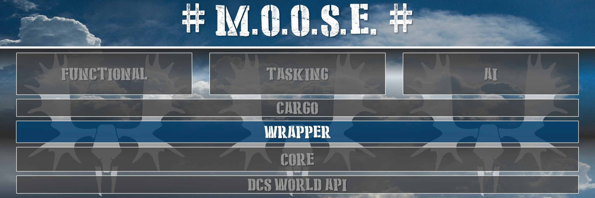
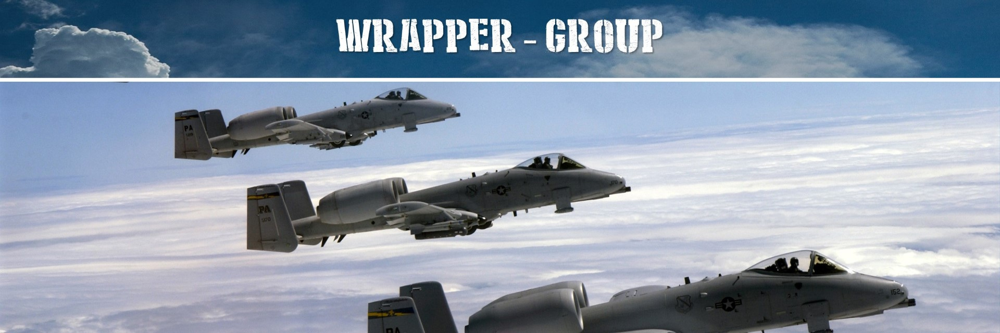
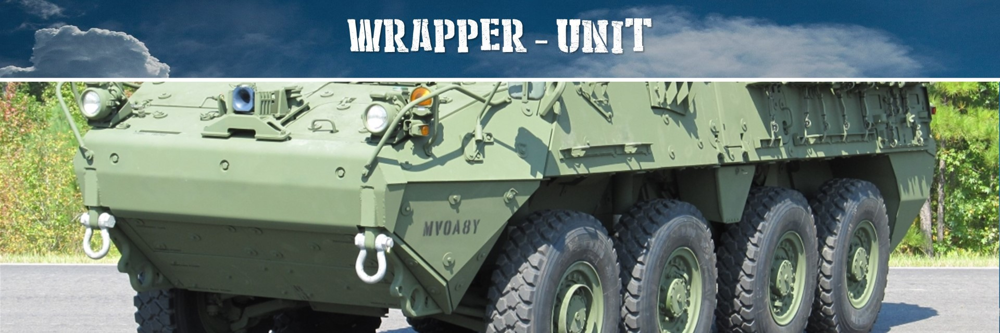
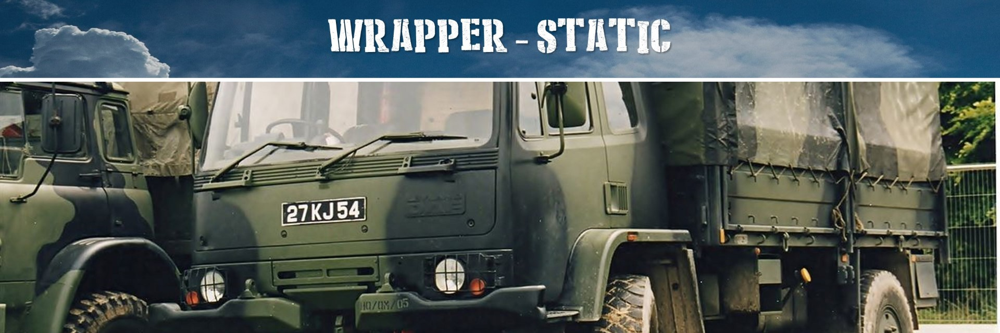
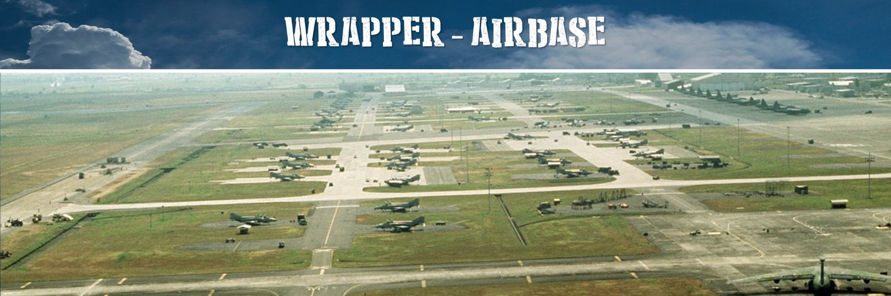

# Wrapper classes guide

This chapter lists the wrapper classes which enhances the functionality for mission designers on the mission objects.

## 1. [GROUP](https://flightcontrol-master.github.io/MOOSE_DOCS_DEVELOP/Documentation/Wrapper.Group.html)

Wraps the DCS _Group_ objects.

**Features:**

  * Support all DCS Group APIs.
  * Enhance with Group specific APIs not in the DCS Group API set.
  * Handle local Group Controller.
  * Manage the "state" of the DCS Group.

## 2. [UNIT](https://flightcontrol-master.github.io/MOOSE_DOCS_DEVELOP/Documentation/Wrapper.Unit.html)

Wraps the DCS _Unit_ objects.

**Features:**

  * Support all DCS Unit APIs.
  * Enhance with Unit specific APIs not in the DCS Unit API set.
  * Handle local Unit Controller.
  * Manage the "state" of the DCS Unit.

## 3. [STATIC](https://flightcontrol-master.github.io/MOOSE_DOCS_DEVELOP/Documentation/Wrapper.Static.html)

Wraps the DCS _Static_ objects.
Note that Statics are almost the same as Units, but they don't have a controller.

**Features:**

  * Wraps the DCS Static objects.
  * Support all DCS Static APIs.
  * Enhance with Static specific APIs not in the DCS API set.

## 4. [AIRBASE](https://flightcontrol-master.github.io/MOOSE_DOCS_DEVELOP/Documentation/Wrapper.Airbase.html)

Wraps the DCS _Airbase_ objects.

**Features:**

  * Support all DCS Airbase APIs.
  * Enhance with Airbase specific APIs not in the DCS Airbase API set.

