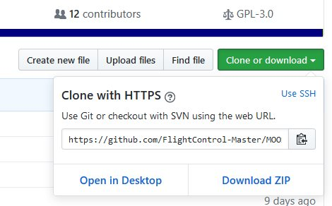
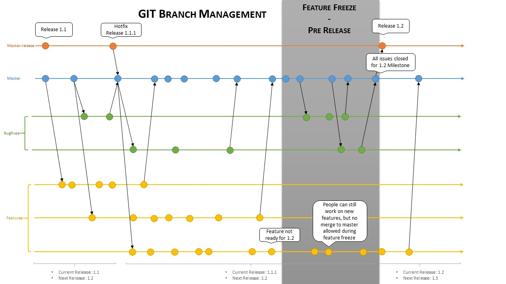
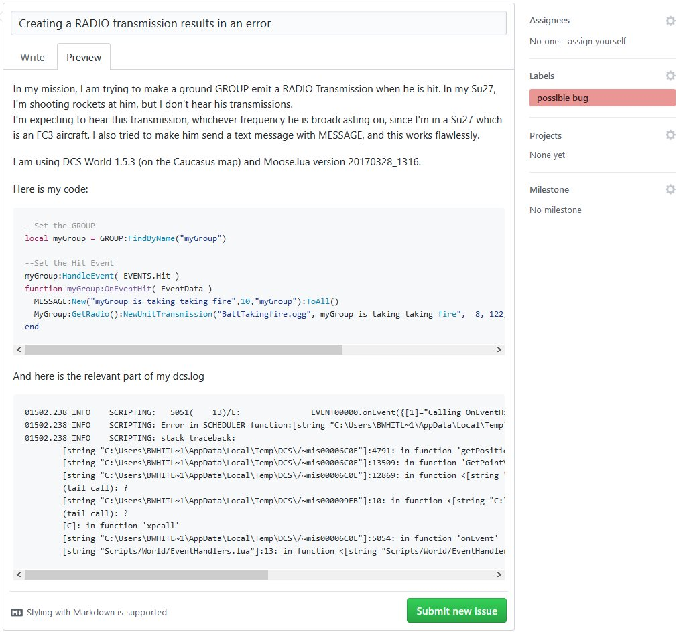

# Beta Tester Guide

You are interrested in **testing the bleeding edge functionalities** and features added by contributors every day,
and you are **not afraid of bugs** that will inevitably crop up from time to time ? Then this page is for you !

You are going to learn:

1. **Installation:** How to set up your development environment
2. **Repository:** How is the Moose repository organized
3. **Loading:** How Moose is loaded in the missions and how this can make your workflow more efficient
4. How to use tools to process your .miz files efficiently
5. How Moose's release cycle work
6. How the Issue Tracker is managed

This might be a bit daunting at first, but the rewards in term of simplified workflow and direct access to new features
is well worth the effort! If you have any problem during the setup or at any other point, don't hesitate to ask the
[community](guide-communities.md) for help!

This guide assumes that **you already setup your development environment**, like a "normal" mission designer.
Which means Lua Development Tools (LDT) is installed on your computer, and you already know how to create a mission
using MOOSE. If it is not the case, please follow the instructions [here](guide-usage.md) before proceeding.

## Installation

Get your MOOSE repository installed on your PC and linked with GITHUB

### Install GitHub desktop

Install [GitHub](https://desktop.github.com) desktop.
Since the MOOSE code is evolving very rapidely between Releases, we store the MOOSE code on GitHub, and we use the
GitHub to sync it between the remote repository (the "origin") and your local MOOSE repository. That way, only one
click is needed to update to the latest version of GitHub.

### Link the MOOSE repository

Link the MOOSE repository on GITHUB to your freshly installed GITHUB desktop.
This is done by browing to the [MOOSE repository at GitHub](https://github.com/FlightControl-Master/MOOSE), and
selecting the green button **Clone or Download** -> **Open in Desktop**.

Specify a local directory on your PC where you want to store the MOOSE repository contents.
Sync the MOOSE repository to a defined local MOOSE directory on your PC using GITHUB desktop (press the sync button).
You now have a copy of the code on computer, which you can update at any time by simply pressing the sync button.

### Install 7-Zip

Install [7-Zip](http://www.7-zip.org/) if you don't already have it. It is a free and open source file archiver program.
Since DCS .miz files are simply renamed .zip files, 7-Zip is very usefull to manimulate them. We are providing the MOOSE
testers and contributors with tools to batch process their .miz files, and they rely on 7-Zip. Keep the path to your
7-Zip installation handy, it will be use in the next step!

# Repository

The MOOSE repository has a couple of folders, but the most important one is the **Moose Development** folder.
This directory contains an other folder called **Moose**. This is the most important folder, as this contains all the
MOOSE source code!

The other directories contained within the repository are for administration and automation of the deployment process.

# Loading the repository within your missions.

## Static Loading

**Moose Static Loading** is what the "normal" mission designer uses.
Simply put, you would include all the code of MOOSE by including **just one Moose.lua file**.
So by executing a DO SCRIPT FILE within your mission, you would load the complete MOOSE code within your mission.
This process is very useful **when you are using a stable Release** of Moose which don't change often,
because it is really easy to set up for the mission designer.
It also allows him to **release missions** which are contained in their entirety in the .miz file.
But in a context in wich Moose changes often, static loading would require the generation of a new Moose.lua
**for every change within the MOOSE framework** and you would need to replace the old Moose.lua in the .miz file you are
using to test the changes. Add to this cumbersome process the fact that the Mission Editor doesn't like changes to the
.miz file while it is open, which means you would need to close and reopen the Mission Editor for every change,
and this process becomes unworkable for both the tester and the contributor.

## Dynamic Loading

So, beyond the Static Loading, there is the Dynamic Loading, which allows a much more smooth proces while testing your
missions.

Enter **Moose Dynamic loading**. In this process, the **Moose.lua** you insert in your .miz file looks for every .lua
which constitute Moose in `DCSWorld\Scripts`, **and asks DCS to load them** during the mission startup.
This way, the latest changes to the MOOSE .lua files in `DCSWorld\Scripts` are automatically taken into account when you
restart the mission, no need to fiddle around with the .miz file or to close the mission editor!
Now, there is still a problem left : you wouldn't want to have to copy the MOOSE .lua files from your local repository
to `DCSWorld\Scripts`, everytime you retrieve a new version of Moose. The solution to this problem is a dynamic link!
Simply put, it makes sure that the folder `DCSWorld\Scripts\Moose` is always in sync with your local MOOSE repository
on your disk. That way, **everytime you want to update to the next Moose, you simply sync your local repository** with
the remote with GitHub, **and restart your mission**!
Note that if you want to **release your missions to end users**, you will need to make it
**use the static loading process**. There is a tool to automate this task, read below.

# Tools to help you manage your .miz files

***TODO : Add a list of the .miz files tools a briefly explain their usages***

# The release cycle

To ensure that the next Release of Moose is as bug-free and feature rich as possible, every Moose contributor respects
a release cycle.

If you are not familiar with Git, this might be a bit criptic, but the idea behind it is simple :

* Most of the time, contributors write code, be it features or bug fixes, and the testers report bugs.
* When a good amount of features are added to the last release, FlightControl decides to enter in a "Feature Freeze"
  period. **No new features are added** during this period (but they can still be worked on), and
  **every bug must be eliminated**. That is the period during which bug reports are paramount!
* Now that this version of **Moose is stable**, we can release it for every mission designer and go back to the start
  for the next cycle.

# The Issue Tracker

## How to report a bug?

If you **encounter** what seem to be a **bug**, which is bound to happen sooner or later since you are testing the brand
new untested features of Moose, you will want to **report it** so that it can be solved by the contributors. We use the
standard GitHub [Issue Tracker](https://github.com/FlightControl-Master/MOOSE/issues). Here is the process to create a
new issue:

* First, do a quick **search on the issue tracker** to see if someone hasn't already reported your issue. If it is the
  case, comment on this issue that you are able to reproduce it, and add the informations listed below.
* **Create a new issue**.
* **Add the information** listed below
* Add the **lablel possible bug**
* Thank you for helping us make Moose better!

**_Informations we need to solve the issue_**

* **A descriptive title**, not too long if possible. For exemple, `CTD when calling SPAWN:New()` is a good title.
  `I found a bug in MOOSE` is not.
* Explain **what you are trying to do**, as well as **how you expect Moose to be behave**.
* Which **version of Moose** and DCS World you are using. This can be found in `dcs.log`
* Did the code you are using worked in previous version of either DCS World or Moose? Which one?
* The **code** or portion of code **that triggered the problem**. Please put  **_\`\`\`lua_**  one line before your
  code, and  **_\`\`\`_**  at the end, to make your code readable.
* The relevant part of **`dcs.log`**. Please put **_\`\`\`_** before and after your copy-pasted log to make it readable.

## How to add a feature request?

* **A descriptive title**, not too long if possible.
* Explain in detail **what you want Moose to do** in which circonstance.
* If possible, add some pseudocode or a high level design implementation to better explain how your feature would work.
* Add the **lablel enhancment**

## The life and death of an issue

**_What is going to happen next to my issue?_**

* A contributor will set some labels and a milestone to your issue, in order to classify it.
* You might be asked to clarify some part of your issue, please answer as swiftly as possible.
* You might be asked to sync your local repository and try again, if we think we fixed your issue. If we can confirm it
  to be fixed the issue is closed.

**_Wait, my issue was closed, and it never got fixed ! / Nobody is paying attention to it !_**

This can happen for multiple reasons:

* Your issue is a duplicate. (There is alredy a issue in our issue tracker for this)
* Nobody was able to reproduce your bug, so we think it's a problem on your end
* Your feature request asks for a feature that already exists
* We think your feature request is a really good idea, but it's a huge time commitment. We therefore postponed it to the
  Realease after the next one, or to a later Release.
* We are working hard and simply don't have the time. We will get around to check your issue, please be patient!
