# Interactive Debugging

The Lua Development Tools in the Eclipse suite has a possibility to "attach a lua debugger" to your LDT environment.
Read this section to setup a debugger in our DCS World environment.

The people who have used debuggers before, will recognize a lot in this explanation!

How it works:

  * Setup a **debug listener** within LDT. When running, it will listen over IP on the local host (127.0.0.1) on a port.
  * Attach a **debug client** to your DCS World configuration. This **debug client** will attach itself to the
    **debug listener** over IP.
  * Modify your mission, so that your source files are loaded **dynamically**. This is very important because DCS World
    **renames** unfortunately the name of the source files when it runs a mission!
  * Set breakpoints where needed. The debugger will stop at the breakpoints set.
  * Run the **debug listener** on LDT.
  * Run the DCS World mission, which uses the **debug client** to connect to the **debug listener** over IP.
  * The logic will stop at the set breakpoints. Using LDT, you can walk through the logic (statements), while inspecting
    variable contents and evaluate expressions.
  * You can set breakpoints during the process where you want, you can add / delete variables in the views where you
    want.

**This capability will give you a new experience in DCS World mission design!**

**Note:** The assets that are used in this description, were modified to accomodate the debugging, so the LDT
off-the-shelf assets aren't working. So use the assets as listed here, or your debugger won't work!

## 1. Explanation of the LDT debugging environment.

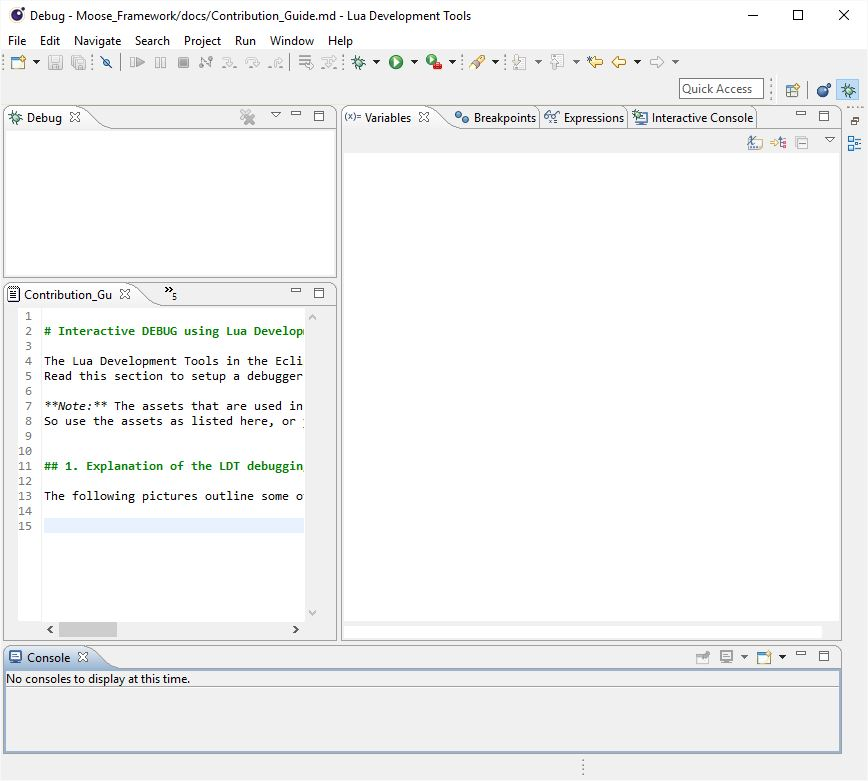

The following pictures outline some of the interesting places in LDT to debug your lua code... A quick manual.

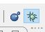

This picture shows a debug view of the LDT environment. You can activate the debug view through the debug icon that is
located in the upper right corner of the LDT.

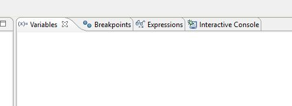

Various windows exist to track the content of:

  * Variables: local and global variables will appear automatically in the Variables window where used.
  * Breakpoints: Breakpoints that are set at lines of various sources, are listed here.
  * Expressions: Various expressions can be entered to evaluate a more complex statement.
  * Interactive Console: Here you can type in commands that will be executed. Here you can SPAWN for example new groups.

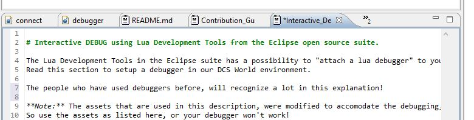

This window lists the sources active in Eclipse.
During a debug sessions, the sources where the process is at the moment of debugging, should be loaded automatically.
If not, something is wrong.
All the other sources that are currently open in the LDT are also listed.

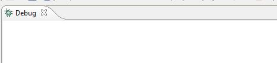

This window shows the status of the "attach debug engine".
If this process is running, it will listen to the IP 127.0.0.1 or localhost if setup on your PC.


## 2. Setup your **debug listener** in LDT.

To use the debug enviornment in LDT, you'll need to setup within LDT a " Lua Attach to Application" **debug listener**.


You can access this screen through the LDT editor menu **Run->Debug Configurations...**.

This is the meaning of each field:

  * Project: The name of the project that you are debugging within your workspace. You need to have a project registered
    here!
  * IDE key: this string is used connect the **debug client** to the **debug listener**.
  * Timeout: the amount of miliseconds you want DCS World to wait for the **debug listener** to be connecting.
  * Source mapping: Select the option "Local Resolution". All the sources are loaded locally from your PC automatically
    when debugging.
  
For the IDE key, this key will be the "link" to the debug connection on the client side!
As will be explained a bit further,  `initconnection( "127.0.0.1", 10000, "dcsserver", nil, "win", "" )` will make a
connection on the **debug client**.
Ensure that the IDE key specified matches up in the **debug listener** and the **debug client**.
So in this example, `"dcsserver"` is the IDE key and should match in the debug Configuration panel and the
`initconnection` parameters!

## 3. Setup your **debug client** and attach it to DCS World mission runtime.

This process is essential.

Within the MOOSE repository, there are two important files that you need to consider.
These files are located in the MOOSE repository
[here](https://github.com/FlightControl-Master/MOOSE/tree/master/Moose%20Development/Debugger).

Download the MOOSE repository or the files on your disk, and read further ...

You should have at least on your disk:

  * debugger.lua
  * READ.ME
  * MissionScripting.lua

### 3.1. debugger.lua.

This is the **debug client**. The source is part of the LDT debug suite, but has been modified to work together with the
DCS World scripting engine. You need to copy this file to the root directory of your DCS World installation in 
Program Files.

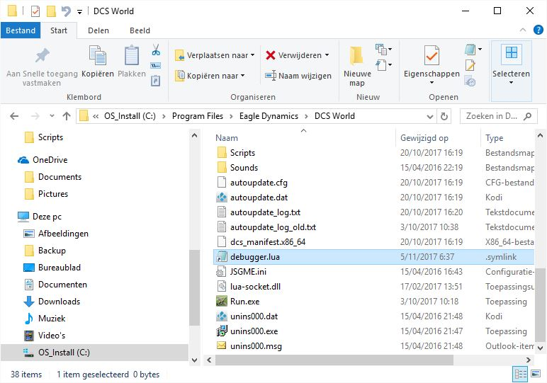

By example, the location of debugger.lua is here on my DCS World installation PC.

### 3.2. Modify the MissionScripting.lua file.

The READ.ME file is a file that contains an explanation of how to modify the MissionScripting.lua.

But for clarity reasons, I've also attached my version of the MissionScripting.lua.

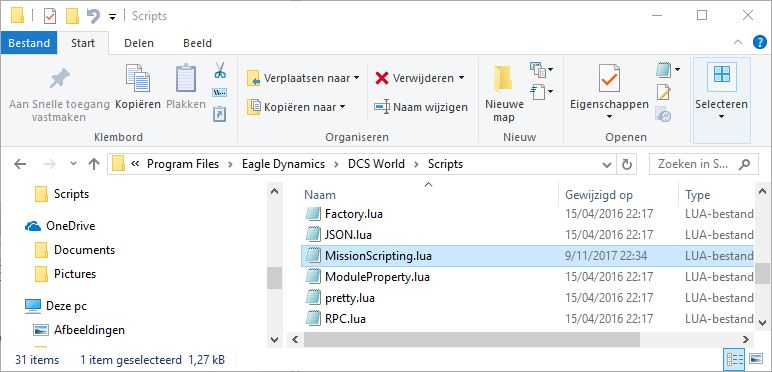


Take the MissionScripting.lua from the folder, and copy / paste (overwrite) the version in your DCS World installation
directory under the Scripts folder.
If you want, you can first rename the existing MissionScripting.lua file to MissionScripting_old.lua
Don't mistake yourself, a lot of mods/tools modify this file during installation. 

Tools like **slmod** etc also change the MissionScripting.lua file (during installation).
So beware that when copying over the file there may be unwanted changes.
If you are using a mod, it is better to do the change manually according the direction in the READ.ME file!

And a validation needs to be done. Once you've modified/overwritten the MissionScripting.lua file, check if the contents
are indeed changed!
Sometimes it seems that the file is saved, but the contents aren't updated due to lack of administration rights and
extra security done by windows.

MissionScripting.lua should contain (at least) the following:

```lua
--Initialization script for the Mission lua Environment (SSE)

dofile('Scripts/ScriptingSystem.lua')

-- Add LuaSocket to the LUAPATH, so that it can be found.
package.path  = package.path..";.\\LuaSocket\\?.lua;"

-- Connect to the debugger, first require it.
local initconnection = require("debugger")

-- Now make the connection..
-- "127.0.0.1" is the localhost.
-- 1000 is the timeout in ms on IP level. 
-- "dcsserver" is the name of the server. Ensure the same name is used at the
-- Debug Configuration panel! nil (is for transport protocol, but not using this)
-- "win" don't touch. But is important to indicate that we are in a windows
-- environment to the debugger script.
initconnection( "127.0.0.1", 10000, "dcsserver", nil, "win", "" )

-- Sanitize Mission Scripting environment
-- This makes unavailable some unsecure functions.
-- Mission downloaded from server to client may contain potentialy harmful lua
-- code that may use these functions.
-- You can remove the code below and make availble these functions at your own risk.

local function sanitizeModule(name)
  _G[name] = nil
  package.loaded[name] = nil
end


do
  sanitizeModule('os')
  --sanitizeModule('io')
  sanitizeModule('lfs')
  require = nil
  loadlib = nil
end
```

Please read through the comment lines for a detailed description what it does.
The io module has been de-sanitized because the debugger.lua needs to use the io module while debugging.

## 4. Setup your .miz file.

When you run a mission in single player in DCS World, a couple of things are happening.

  1. The .miz (mission) file that was selected to run, is unzipped in a temp folder on your drive.
  2. Each lua file that is included in a DO SCRIPT FILE, is **RENAMED** to a file structure like ~mis__nnnnn__.lua.
     This is very bad. Because this prevents you from settings breakpoints at the source file and ensure that the
     debugger recognizes the source during run and the location of the breakpoint!

So we need to do something special. The trick is **dynamic loading**.
And believe me, it is the only way to be able to debug your sources.
So this is a little task that you need to learn how to do, but once you understand it, it will become very easy to do.

Instead of executing a DO SCRIPT FILE, you need to add a couple of things in your .miz file.


### 4.1 Conditionalize the DO SCRIPT FILE execution.

Keep the DO SCRIPT FILE line in your mission. Why? Because if you would remove it, and you woudn't debug your code, your
mission file would be deleted. Instead, we are going to put a flag before this part of the execution. A debug flag.
For example, in my mission I put a debug flag 999. When 999 is ON, I would NOT execute the mission file...

Follow this process how to do that... As my recommendation...

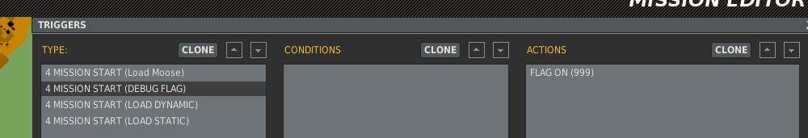

Setup a debug flag... If you wanna debug, set flag 999 to ON.

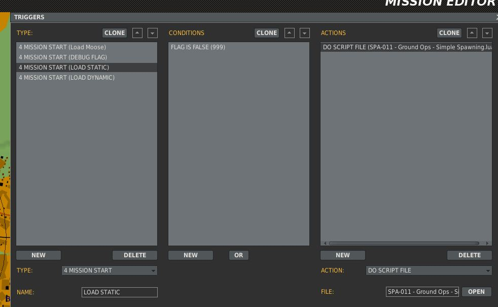

Conditionalize the DO SCRIPT FILE execution by evaluating if the 999 is OFF.


### 4.2 Add a dynamic loader to debug your mission script.

Now we are adding a little line.
We are now going to ADD a **dynamic loader** of your mission source.

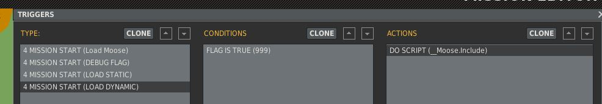

This loads the file dynamically. Instead of a DO SCRIPT FILE, we execute here a DO SCRIPT.
The DO SCRIPT contains a little piece of code that loads your source file from a location on your disk.

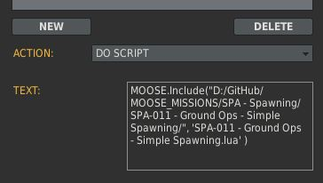

This is how my piece of code looks like. I am using a stub of the MOOSE framework to load the file.

`MOOSE.Include( full_path_name, file_name )`

  * The `full_path_name` needs to be between quotes, **follows unix folder notation** and **needs to end with a /**
  * The `file name` is the full file name, **including the .lua extension**!

  
If you don't wanna use __Moose.Include, no worries, there is another method.

`_G.loadfile( full_path_name .. file_name )`

The MOOSE.Include loader uses _G.loadfile to load the sources. But it does a bit more checking and logs in dcs.log which
files were dynamically loaded, and from which location!

### 5. Run the **debug listener** on LDT.

Now we are all setup! You've got your **debug listener** setup in LDT, you got your **debug client** setup and connected
to your DCS World environment, and you got your mission file ready for debug!

Now we are going to run a debug. To have a successful debug run, you need to start the listener in LDT.

### 5.1. Setup your debug favorite.

First we setup the Debug as your "favorite", so that it is easy for your to repeat the run easily.

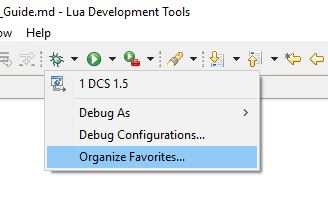

Click on the "Bug" icon that you'll find in the task bar. The "Bug" icon is the place where you will start your
**debug listener**. However, first, click on Organize Favorites. You need to do this one time only.

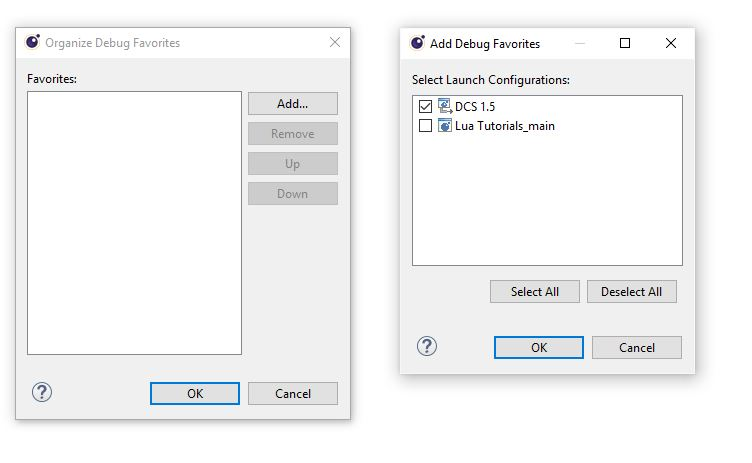

Just click on the Debug Name that you entered (for me DCS 1.5) in the Debug Configuration window and it will be added to
your favorites. I did already that, so it was already added as an example in the previous picture.

### 5.2. Run the **debug listener**.

Now you can easily activate the **debug listener**.

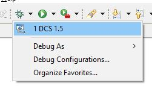

Just click the "Bug" again, and select the **debug listener** that you configured.

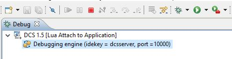

When done, you'll see that the **debug listener** is running!

It will be listening quietly to IP 127.0.0.1 on port 100000.

### 6. Set breakpoints.

Open your source file **from the exact location** from where you have specified it to be loaded as part of the
**dynamic loading**. Once it is loaded, you can attach breakpoints within the editor.

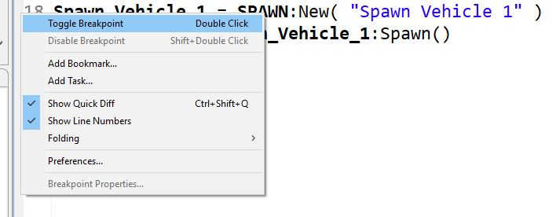

How? Right click on the source line number or the grey area before the line, and a pop-up window will appear. Select
"Toggle Breakpoint".

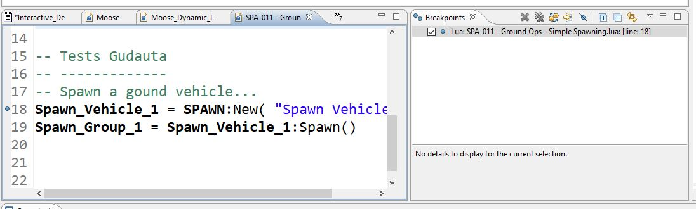

As a result, the breakpoint will be listed in the "Breakpoints" list at the debug view, and it will show also the line
number where the breakpoint is set. When your mission runs, the logic will stop at this line!!!


### 7. Run your DCS World mission.

Now it is time to start your DCS World mission. Just run it as you would like have it.

  1. The **debug client** (debugger.lua) is loaded as part of the MissionScripting.lua file.
  2. The **debug client** connects to the **debug listener** on ldt using 127.0.0.1 using port 10000.
  3. Your **mission source** will be **loaded dynamically**.
  4. Your mission will start running.
  5. Debugger is active and will monitor if a breakpoint has been set at the source currently active during runtime of
     your mission.
  6. Once it matches a valid breakpoint at a valid source and a specified line, it will stop the logic!
  

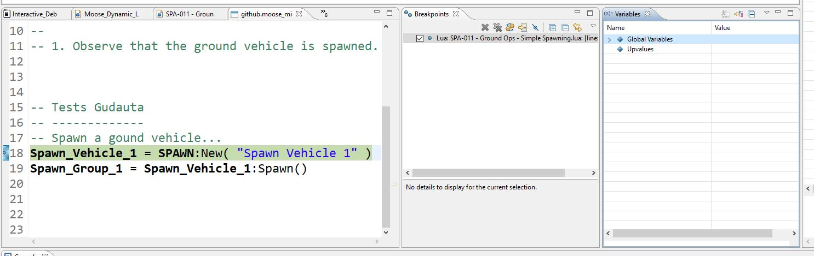


### 8. Next steps.

There is a lot to say about debugging and the techniques that you can use how to track the code.
For this, videos will be made in the MOOSE For Dummies video series.

Please consult the youtube channel for more info on debugging.


### 9. Sequel.

When I started to use DCS World (discovered it by accident), I was sold.
After a while I started to discover the SSE capabilities of DCS World and started to code lua.
But a very important piece was missing while developing the MOOSE framework. 

**A debugger**.

I've been searching for about 4 years to get this working. There was a huge learning curve.
I had to "hack" myself into the LDT environment and modify the LDT assets to make this work.
There were moments of "clarity" that made me understand how it all fits together.
And now it is there. Wanted to share this for all users of DCS World.

It does require a bit of effort to use this in the DCS World environment, but the little effort
is a small trade against the huge advantages here!

I also encourage you to use the MOOSE Framework, as it brings you a lot of great capabilities
you will never have in any editor. Being able to debug your code, will solve a lot of your questions now!

I hope you will all have fun with the new debug capability and that it may result in greater missions.
