# LDT Setup Guide

Using the MOOSE framework is very easy, and this document provides you with a detailed explanation how to install
and use MOOSE within your missions.

## 1.1) MOOSE Framework on GITHUB

For reference, you can find the source code of [MOOSE framework on GitHub].
It is free for download and usage, since it is released under the GNU 3.0 open source license policy.
You don't need to use the source code as an end-user, but it may help to sneak into the code and understand how certain
things are working.

## 1.2) Write your scripts using MOOSE in a normal text editor

You can use the MOOSE framework with a normal text editor. This is perfectly okay.
But you won't have IntelliSense enabled, which is an interactive documentation system that helps you to code correctly!
Therefore, it is highly recommended you use the Eclipse LDT editor, which is explained below.

## 1.2) Eclipse LDT

The LDT environment or "Eclipse Lua Development Tools" is a fully integrated development environment for LUA developers.
It is recommended to use the LDT as your mission design editor using MOOSE.
The MOOSE framework is documented using the lua documentation standard within the MOOSE code.
As a result, every class, method and variable is documented within the source code
and mission designers can write mission script lua code that is **intellisense**(-ed).
What that means is that while you are coding your mission, your object and variables (derived from MOOSE classes)
will list interactively the methods and properties of that class interactively while coding.

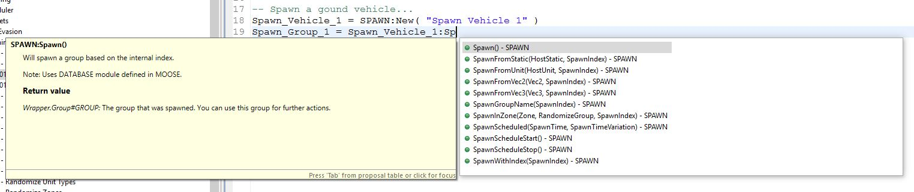

This highly increases the quality and the speed of your scripting.

## 1.3) LUA training

In order to efficiently use the MOOSE framework, it is highly recommended that you learn a couple of basic principles of
lua. I recommend you learn the basic lua principles following this [lua tutorial](https://www.tutorialspoint.com/lua).
We're not asking you to become an expert in lua, but you'll need to have some basic lua coding knowledge to "understand"
the code, and also, to understand the syntax.

**Therefore, I suggest you walk through this [lua quick guide](https://www.tutorialspoint.com/lua/lua_quick_guide.htm)**.
Ignore the lua environment setup. DCS comes with a pre-defined lua environment.

# 2) Download the latest release of MOOSE

The delivery of MOOSE follows a structured release process.
Over time, new features are added that can be used in your mission.

MOOSE can be downloaded on the main release gage on [GitHub](https://github.com/FlightControl-Master/MOOSE/releases).

**Unzip the files into a directory of your choice, but keep the folder structure intact**.
Also, you'll notice that there are two files included:

  - Moose.lua
  - Moose_.lua

These are include files that you need to include within your mission.
These files contain ALL the MOOSE code in one file.
See a more detailed explanation below.

# 3) Download the software

## 3.1) Download and install the Eclipse Lua Development Tools **(LDT)**, which is an advanced lua editor.

1. If you don't have JAVA yet, you may have to install [java](https://www.java.com/en/download) first.
2. Download and Install [Eclipse LDT](https://eclipse.org/ldt) on your Windows 64 bit system.

Now you should have a working LDT on your system.
Don't skip this step, LDT is a game-changer.

# 4) Setup the **Moose_Framework project** in LDT.

You need to configure your Eclipse LDT environment and link it with the Moose code.
This will enable you to **start developing mission scripts** in lua, which will be **fully intellisense enabled**!

Please follow the steps outlined!

## 4.1) Create a new **Workspace** in LDT.

The LDT editor has a concept of **Workspaces**, which contains all your settings of your editing environment,
like views, menu options etc and your code. Nothing to pay attention to really, but you need to set it up!
When you open EclipseLDT for the first time, it will ask you where to put your *workspace area*.

1. Open Eclipse LDT.
2. Select the default workspace that LDT suggests.

## 4.2) Setup a **new project** in LDT and name it **Moose_Framework**.

### 4.2.1) Select from the Menu: **File** -> **New** -> **Lua Project**.

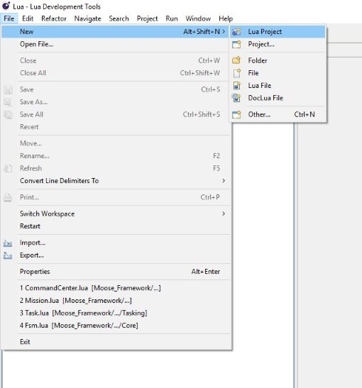

Here, we will create a **New Project** called **Moose_Framework** in your LDT environment.

### Important! Name your project **Moose_Framework**

The project details are already defined within the MOOSE framework repository,
which is unzipped in your **local Moose folder** on your PC.
We will link into that directory and **automatically load the Project properties**.

### 4.2.2) Type the Project Name: **Moose_Framework**.

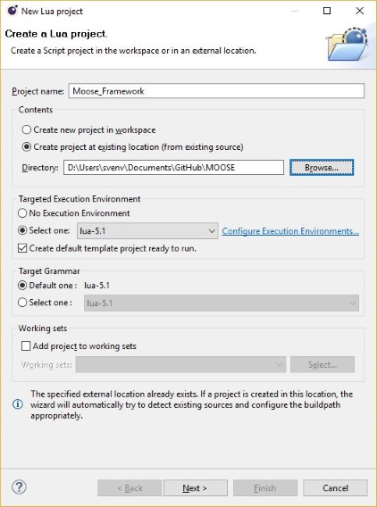

### 4.2.3) In the sub-box "Project Contents", select the option **Create Project at existing location** (from existing source).

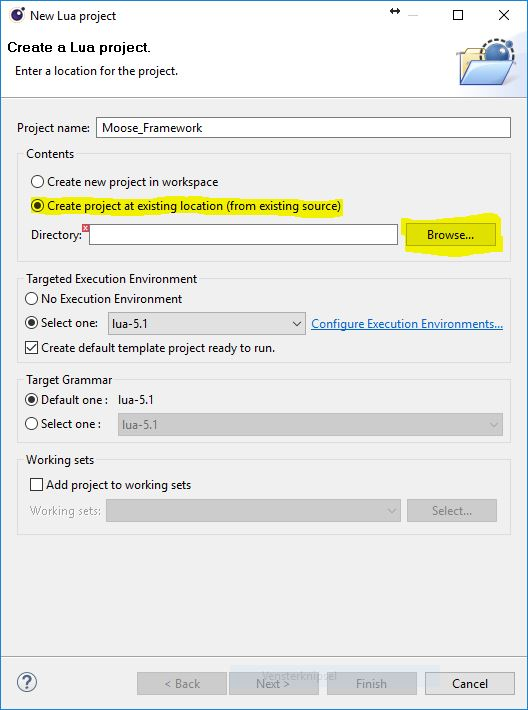

### 4.2.4) **Browse** to the local MOOSE directory (press on the Browse button) and select the **local Moose folder on your PC, which you unzipped**. Press OK.

### 4.2.5) You're back at the "New Project" dialog box. Press the **Next** button below the dialog box. 

__(All the other settings are by default ok)__.

### 4.2.6) You should see now a dialog box with the following properties. 

The Moose Development/Moose directory should be flagged as the **Source Directory*. (It is listed totally on top.) 
This is important because it will search in the files in this directory and sub directories for lua documentator enabled lua files. 
This will enable the intellisense of the MOOSE repository!

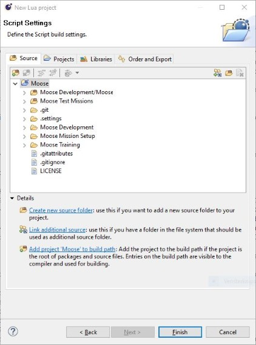

### 4.2.7) Press the **Finish** button.

As a result, when you browse to the Script Explorer, you'll see the following:

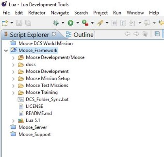

### 4.2.8) **Congratulations! You have now setup your Moose_Framework project LDT environment!**

# 5) Setup a new project **Moose_Missions** in LDT, containing the the Moose demonstration missions.

The framework comes with demonstration missions which can be downloaded
[here](https://github.com/FlightControl-Master/MOOSE_MISSIONS), that you can try out and helps you to code.
These missions provide examples of defined use cases how the MOOSE framework can be utilized.
Each test mission is located in a separate directory, which contains at least one .lua file and .miz file.
The .lua file contains the mission script file that shows how the use case was implemented.
You can copy/paste the code snippets from this .lua file into your missions
This will accellerate your mission developments. You will see, learn and understand how the different MOOSE classes
needs to be applied and how you can create more complex mission scenarios by combining these MOOSE classes into a
complex but powerful mission engine.
Some of these exact test missions are also demonstrated in a video format on the
[YouTube channel](https://www.youtube.com/channel/UCjrA9j5LQoWsG4SpS8i79Qg).

  - Download the [Moose demonstration missions](https://github.com/FlightControl-Master/MOOSE_MISSIONS/) latest release package.
  - Unzip the package into a local folder on your PC.
  - In LDT, select from the menu **New lua project**, and name it Moose_Missions.
  - Select the local folder on your PC, where you saved the demonstration missions contents.
  - Press Finish

# 6) Setup Your first mission

## 6.1) Setup a new project in LDT and name it **My_Missions**

In order to design your own missions, it is recommended you create a separate directory on your PC
which contains your mission files. Your mission will be designed consisting possibly
out of a couple of components, which are:

  * (Mandatory) An include of the **Moose.lua** file (see chapter 2 above).
  * (Mandatory) An include of your lua mission script file(s) (also with a .lua extension).
  * (Optionally) Sound files (.ogg) and pictures (.jpg) which are added into your mission.

Using the menu system of the DCS World Mission Editor, you need to include files in your mission (.miz) file.
However, once included, maintaining these files is a tedious task,
having to replace each time manually these files when they change
(due to a new release or a change in your mission script).

Therefore, **the recommendation is that your create for each mission a separate folder**.
The MOOSE test mission folder structure is a good example how this could be organized.
The LDT has been customized and provides a tool to **automatically** maintain your existing .miz files.

### 6.1.1. Select from the Menu: **File** -> **New** -> **Lua Project**.

### 6.1.2. A **New Project** dialog box is shown.

### 6.1.3. Type your Project Name: (In my example it is **DCS_Caucasus_Missions**.

Note the indicated options in yellow:

  * Note that you can select the option **No execution environment**.
  * Deselect the option **Create default project template ready to run**.

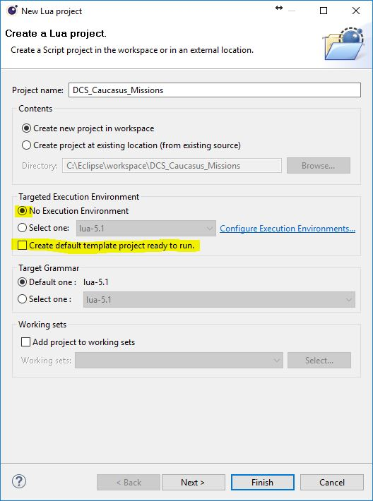

### 6.1.4. Press **Next >**

### 6.1.5. Click the **Projects** tab at the top of the window.

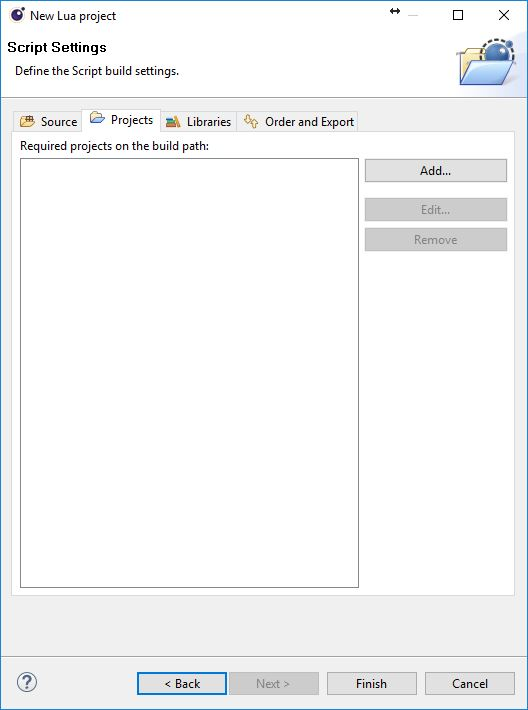

### 6.1.6. Press the **Add...** button.

### 6.1.7. A new windows will be displayed: **Required Project Selection**.

This is an important step. This will _link_ your project to the Moose_Framework project and will activate **intellisense**.

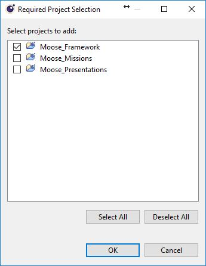

### 6.1.8. After the selection, press the **OK** button.

### 6.1.9. Watch your newly created project in the Script Explorer of LDT.

You can delete the possibly created SRC directory. You won't need it at all.

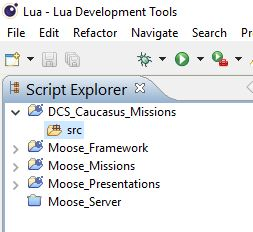

### 6.1.10. Within your newly created Missions Project, right click and select **New -> Folder**.

As explained above, each of your missions will be stored in a separate folder. Please follow the explanation how to do that.

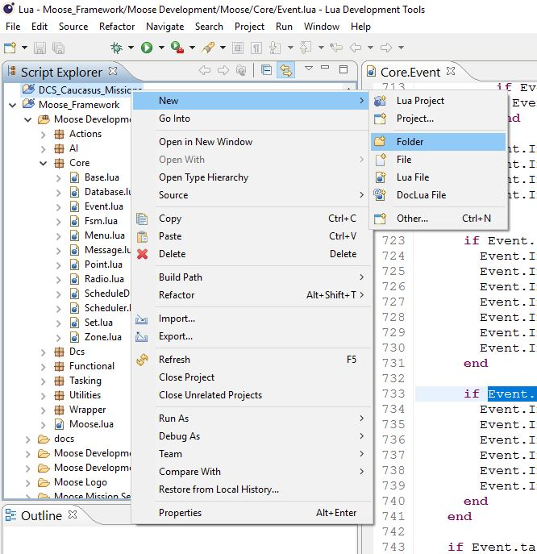

### 6.1.11. Type the **Folder Name**.

This can be any descriptive text explaining the title of your mission.

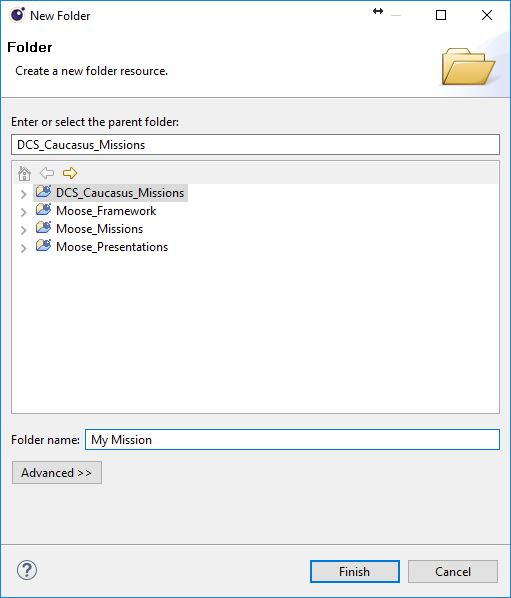

### 6.1.12. In your newly created **Mission Folder**, right click and select **New -> Lua File**.

This will create your **mission script file**,
the file that contains all the lua code using the Moose framework using your mission.

### 6.1.13. Type the **Lua Mission Script Name**.

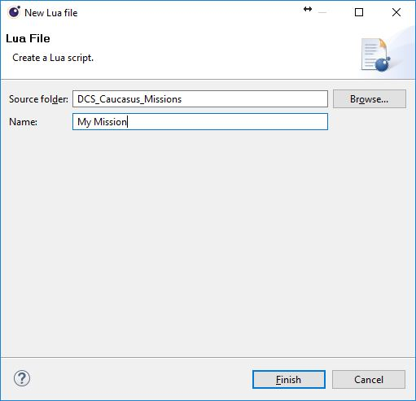

## 6.2) Create your first Mission file

In the root of the MOOSE package, a file named **Moose.lua** can be found.
In order to create or design a mission using the MOOSE framework,
you'll have to include this **Moose.lua** file into your missions:

  1. Create a new mission in the DCS World Mission Editor.
  2. In the mission editor, create a new trigger.
  3. Name the trigger Moose Load and let it execute only at MISSION START.
  4. Add an action DO SCRIPT FILE (without a condition, so the middle column must be empty).
  5. In the action, browse to the **Moose.lua** file and include this file within your mission.
  6. Make sure that the "Moose Load" trigger is completely at the top of your mission.

Voila, MOOSE is now included in your mission. During the execution of this mission, all MOOSE classes will be loaded
and all MOOSE initializations will be exectuted before any other mission action is executed.

Find below a detailed explanation of the actions to follow:

### 6.2.1. Open the Mission Editor in DCS, select an empty mission, and click the triggers button.

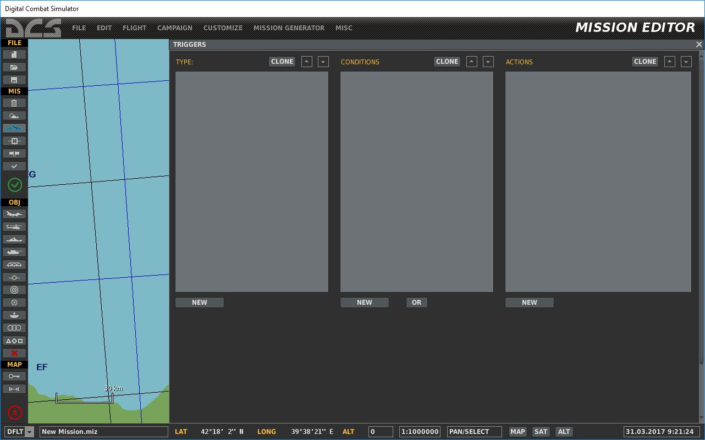

### 6.2.2. Add a new trigger, that will load the Moose.lua file.

Check the cyan colored circles:

  * This trigger is loaded at MISSION START.
  * It is the first trigger in your mission.
  * It contains a DO SCRIPT FILE action.
  * No additional conditions!

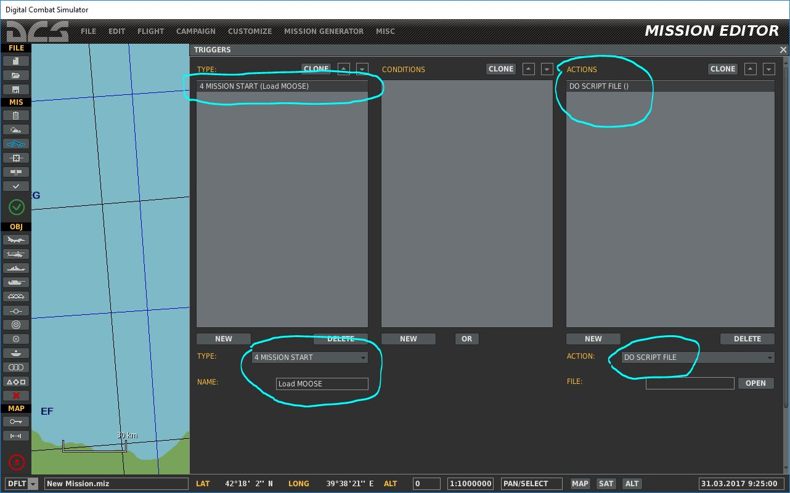

### 6.2.3. Select the Moose.lua loader from the **Moose Mission Setup** folder in the Moose_Framework pack.

Additional notes:

  * If you've setup a folder link into Saved Games/DCS/Missions/Moose Mission Setup, then you can directly select this
    folder from **My Missions**.
  * See point ...

Press the **OK** button.

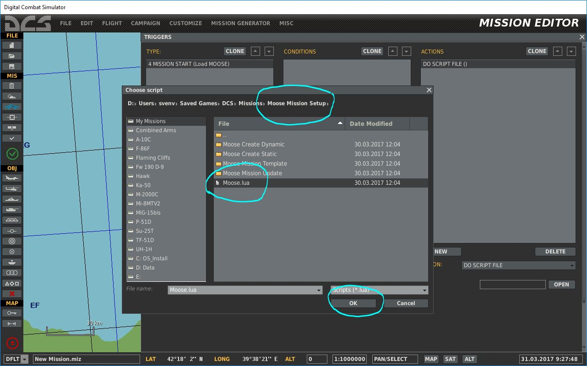

### 6.2.4. Check that the Moose.lua file has been correctly added to your Mission.

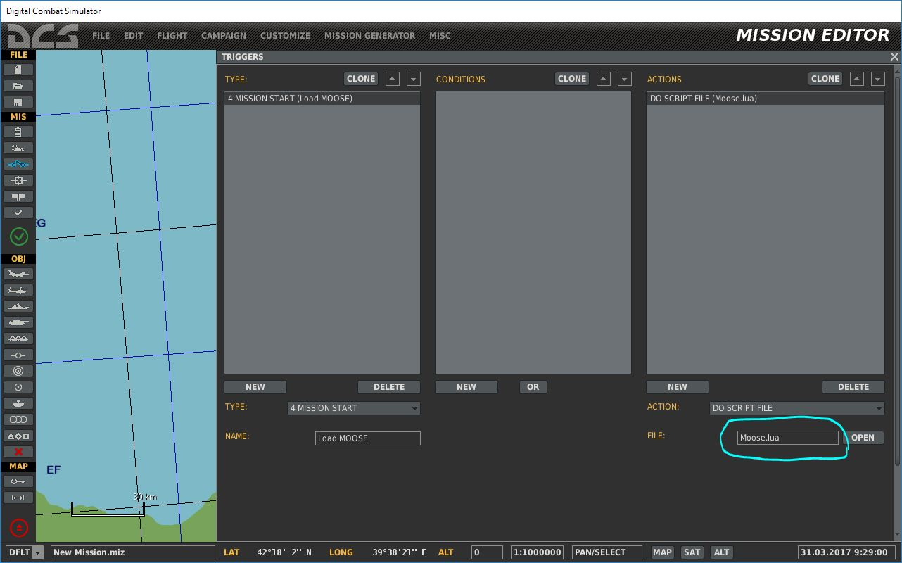

### 6.2.5. Add a new trigger, that will load your mission .lua file.

Check the cyan colored circles:

  * This trigger is loaded at MISSION START.
  * It is the second trigger in your mission.
  * It contains a DO SCRIPT FILE action.
  * No additional conditions!

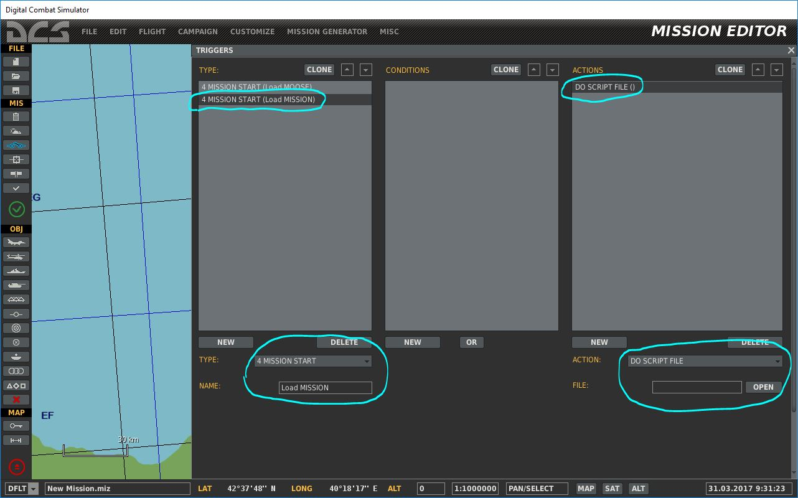

### 6.2.6. Select the mission .lua file from your **missions** folder you just created or already have.

Additional notes:

  * If you've setup a folder link into Saved Games/DCS/Missions/Moose Mission Setup, then you can directly select this folder from **My Missions**.
  * See point ...

Press the **OK** button.

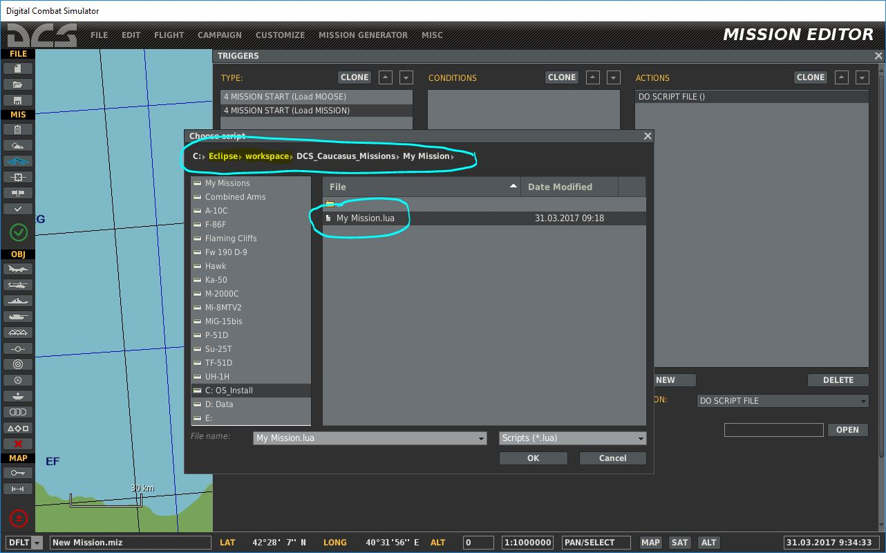

### 6.2.7. Check that your mission .lua script file has been correctly added to your mission.

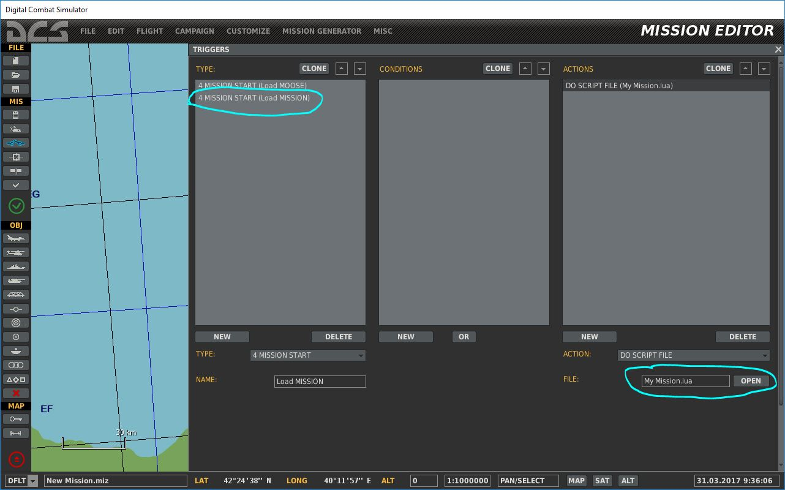

## 6.3) Maintain your .miz files

IMPORTANT NOTE: When a new version of MOOSE is released, you'll have to UPDATE the Moose.lua file in EACH OF YOUR MISSION.
This can be a tedious task, and for this purpose, a tool has been developed that will update the Moose.lua files automatically within your missions.

### 6.3.1. Select the **Update SELECTED Mission** from the External Tools in LDT.

This will activate a script that will automatically re-insert your mission .lua file into your mission.

## 6.4) Create folder links into your "My Missions" folder in Saved Games/DCS/Missions.

***TODO : Detail how hard links work, explain how they help the wworkflow***

This trick will save you a lot of time. You need to install the tool ... to create easily new links.

Select from the following possible links that can be created to save you time while browing through the different folders to include script files:

### 6.4.1. Create a link to your **Moose Mission Setup** folder ...

### 6.4.2. Create a link to your **missions** folder ...

[MOOSE framework on GITHUB]: https://www.github.com/FlightControl-Master/MOOSE/
