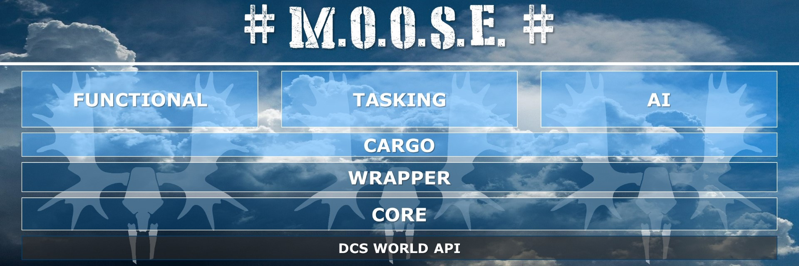

# Archive

{: .important }
> This documentation is outdated! We are working on new a documentation.

Here you can find the guides written by FlightControl in the past.
Most of the informations are still valid. But we want to create a more up-to-date
documentation in the future.

The first step to do this, is to consolidate the differents versions of the
documentation from [MOOSE_DOCS] and [MOOSE_DOCS_DEVELOP] into this place.
After that we can create a new documentation step by step.

[MOOSE_DOCS]: https://github.com/FlightControl-Master/MOOSE_DOCS
[MOOSE_DOCS_DEVELOP]: https://github.com/FlightControl-Master/MOOSE_DOCS_DEVELOP

MOOSE is a **M**ission **O**bject **O**riented **S**cripting **E**nvironment, and is meant for mission designers and
mission hosters. It allows to quickly setup complex missions using pre-scripted scenarios using the available classes
within the MOOSE Framework. MOOSE works with the current DCS world and earlier versions.

## Starters guide

You need to write lua code (scripts) to apply the MOOSE framework. But it is not really that hard, if you understand
a couple of principles. Read more in the [Starters Guide](guide-starters.md).

## Mission Designers Guide

This section is meant for those who really want to start using MOOSE and write lua scripts for their missions.
The section provides a comprehensive overview of the different classes that form the complete MOOSE framework.
Here you find a high-level explanation and features, how to:

   * Setup AI dispatchers to create complex and coordinated AI behaviour.
   * Cargo handling
   * Setup task dispatchers for Mission completion
   * How to use MOOSE wrapper classes
   * The different components of the core MOOSE engine

Read more in the [Mission Designers Guide](guide-designers.md).

Each class will link you further down into the MOOSE Classes guide, for more detailed information on each MOOSE class.

## MOOSE Classes Guide

Here you can find detailed documentation for each MOOSE class.
Click on the hamburger menu on the left upper corner of each page to navigate to other MOOSE classes.

- `master` branch: <https://flightcontrol-master.github.io/MOOSE_DOCS/>
- `develop` branch: <https://flightcontrol-master.github.io/MOOSE_DOCS_DEVELOP/>

## MOOSE Setup

The delivery of MOOSE follows a structured release process. Over time, new features are added that can be used in your mission.

The latest release of MOOSE can be downloaded [here](https://github.com/FlightControl-Master/MOOSE/releases).

There are 3 different ways how you can use MOOSE, each with a different engagement and complexity level:

### Setup for Mission Designers

This section shows how to setup a development environment for Mission Designers using the MOOSE framework.

  - Download and install Java.
  - Setup Lua Development Tools IDE (from the Eclipse suite).
  - Setup a logging tool.
  - Tweak your DCS environment.

Please read the detailed [LDT Setup Guide](guide-setup-ldt.md) for more information.

### Setup for Beta tester guide

Beta testers of MOOSE are requested to install additional software.

As a return or as a reward, testers get:

  * Newly developed features planned for the next MOOSE release can be tested and incorporated in your missions early.
  * You can evaluate and contribute to the stability of the next release.
  * Your mission creation workflow becomes very flexible. New features are dynamically added to you missions.

Please read the detailed [Beta Tester Guide](guide-beta-tester.md) for more information.

### Contribute on the MOOSE development

Those people who have experience in lua development or are excited to contribute to the MOOSE project are welcome.

Please consult the [Contribution Guide](guide-contribution.md) for more information.

### Debug your code interactively using LDT

Have a look at the [Interactive Debugging](guide-debug.html) to setup your system so you can debug your mission code.

## MOOSE Support Channels

MOOSE is broadcasted, documented and supported through various social media channels.

Click here for the [Communities Guide](guide-communities.md) of the MOOSE framework.

## MOOSE framework goal

The goal of MOOSE is to allow mission designers to **enhance the mission designs** by using **mission orchestration objects**,
which can be _instantiated_ from defined classes within the framework.
This will allow to write exciting missions and multi player cooperative operation scenarios.

Of course, the richness of the framework will determine the richness of the misson scenarios.
The MOOSE is a service that is produced while being consumed ... ,
it will evolve further as more classes are developed for the framework, and as more users are using it.

MOOSE is NOT meant to be a one-man show, it is meant to evolve within a growing community around the framework.

Within the community, key users will support, document, explain and even create new classes for the framework.
It is the ambition to grow this framework as a de-facto standard for mission designers to use within the DCS World community.

## MOOSE community on Discord

Join our MOOSE community on Discord.
A place where mission designers and developers come together to discuss the latest features.
There are a lot of people supporting Mission Designers on [Discord](https://discord.gg/gj68fm969S).

Thank you!
The Moose Team
