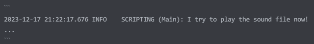

# How to ask for help
{: .no_toc }

1. Table of contents
{:toc}

After you have tried to solve the problem on your own, you can also get help
from the community.

{: .highlight }
> But it is important to follow certain rules! Read them below.

## Communities

There are two ways to communicate with the community.
The fastest way is to use Discord:

- <https://discord.gg/gj68fm969S>{:target="_blank"}

But if you don't like Discord, you are able to post in the DCS forum.
Check out the MOOSE thread here:

- <https://forums.eagle.ru/showthread.php?t=138043>

## How to post requests

MOOSE is a community project and support is community based.

Please remember when posting a question:

- Before posting anything follow the [troubleshooting steps].
- **Read your logs**.

### Formulate a good description

A post should contain the following:

- A description what you expected to happen and what actually happened.
  - Do not use vague words this stuff is hard to help with! Be specific.

- Describe what happens instead.
  - The less detail you offer, the less chance you can be helped.
  - Don't say it doesn't work. Or is it broken. Say what it actually does.

### Format your code

The easier your code is to read, the more likely you are to get a helpful answer. If your code is hard to read, some
people who could help you may not even bother to read your code. Syntax Highlighting makes the code much clearer and
easier to understand. Therefore:

- Post your code in Discord as formatted code:

  - Wrap a single line of code in backticks \` like this:

    

  - Multiple lines of code should be posted like this:

    

### Do not post a screenshot of your code

Your code is easy to read on a screenshot if you are using a good text editor or IDE, but if someone discovers an error
in your code and wants to post a corrected version, they will have to type out the entire code. This could lead to them
not helping you because it's too much work for them.

### Post your log

If the error message in the `dcs.log` does not tell you anything, then post it in the Discord.

- Post the important log lines with the error or warning messages. Format them like this:

  

### Send your mission when requested

Please don't just send your mission file. You have to manually extract the script from the file.
It is better to send your script code and log lines beforehand.
If this does not help, you may be asked to send your mission.

- Some complex problems need the mission (.miz file) also.

  - But post your mission only when requested.
  - Try to simplify your mission if it is complex!
  - Try to avoid or delete MODs, because could prevent people from helping you.

There are people in the Discord and in the forum, who spend their free time to
help you.  
It is your responsibility to make their "work" as easy as possible.

Welcome to MOOSE and good luck!

## Next step

Last but not least some [tipps and tricks].

[troubleshooting steps]: problems.md
[tipps and tricks]: tipps-and-tricks.md
