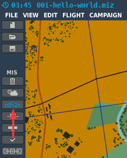
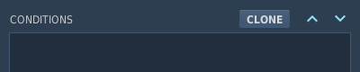
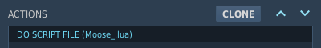

# Create your own Hello world
{: .no_toc }

1. Table of contents
{:toc}

This page will lead you step by step through the process of creating a mission
with MOOSE. This time we include a simple mission script, which sends only
a "Hello world" message to all players. But the steps are the same to add
another mission script, which will do whatever class(es) you want to use.

## Create Mission script

At first we will create the mission script. It is a simple text file and can be
changed with a lot of different tools. Theoretically even the Microsoft Notepad
editor can be used. But it lacks a lot of features, which helps you to avoid
errors.

For this guide we suggest you to download, install and use [Notepad++]{:target="_blank"}.

{: .important }
> Windows hides filename extensions by default. So when you create a text file
> and name it `hello-world.lua` it's name is `hello-world.lua.txt` in reality.
> You must activate the display of the file name extension.
> Open a `File Explorer`, switch to menu `View` and find the option
> `File name extensions` in the section `Show/hide`. Activate it.

- Open a File Explorer.
- Go to the subfolder `Missions` of your [Saved Games folder]{:target="_blank"}.
- Create a new text file and name it `hello-world.lua`.
- Add the following content and save the file:

  `MESSAGE:New( "Hello World! This messages is printed by MOOSE", 35, "INFO" ):ToAll()`

## Get Moose

To download Moose click on the following link:

- [Moose_.lua from develop branch]{:target="_blank"}

Press `Ctrl + S` to save the file on your hard disk next to your mission script.

## Create the mission

- Start DCS.
- In the main menu choose `MISSION EDITOR`.
- Click on `create new mission`.
- In the dialog `NEW MISSION SETTINGS`:
  - Choose map `Caucasus`.
  - In the drop box upper left choose `Modern` as coalition preset.
  - Click on `OK`.
- The mission editor will load with a fresh new and empty mission.
- Click on `File` in the menu bar and `SAVE` or Press `Ctrl + S`.
- Open `My Missions` and save the file with the name `hello-world.miz`.

## Add Moose to the mission

- On the left side activate `TRIGGERS`:

    

- On the right side the `TRIGGERS` dialog opens with a lot of options.
- Click on `NEW`, choose `4 MISSION START` as **TYPE**.
- Give it the `Load MOOSE` as **NAME**.
- Leave the **EVENT** option set to `NO EVENT`.
- Optional: Choose a color for easy recognition (e.g. yellow).

    

- In the middle part the `CONDITIONS` will be shown.
  For this trigger we do not configure any conditions.

    

    {: .important }
    > The trigger type `4 MISSION START` does not support `CONDITIONS`.  
    > So `CONDITIONS` must left blank when using it.  
    > **If you add a condition the trigger will never be executed!**

    

- On the right side `ACTIONS` is shown.
- We need to click on `NEW`.
- Choose **ACTION** `Do SCRIPT FILE` and ignore all other actions.
- Click **OPEN** and navigate to the downloaded `Moose_.lua` file.
- The result should look like this:

    

## Add the mission script

- Click on `NEW`, choose `1 ONCE` as **TYPE**.
- Give it the `Load Mission Script` as **NAME**.
- Leave the **EVENT** option set to `NO EVENT`.
- Optional: Choose a color for easy recognition (e.g. green).
- The result should look like this:

    

- Switch to the middle part, the `CONDITIONS` section.  
  For this trigger we add one condition:

    

- The combination of `1 ONCE` with `TIME MORE(1)` will ensure, that the mission
  script is executed 1 second after the mission is started.

- On the right side under `ACTIONS` you need to add the script:
- Click on `NEW`.
- Choose **ACTION** `Do SCRIPT FILE`.
- Click **OPEN** and navigate to the created `hello-world.lua` file.

{: .important }
> Most important is the fact, that the mission script (`hello-world.lua`)
> is executed **after** `Moose_.lua`, because the mission script needs the
> classes defined in `Moose_.lua`. And they are only available when `Moose_.lua`
> is executed before the mission script.

## Test the mission

- Save the mission again.
- Click on the green **Fly mission** cirlce on the left tool side bar.
- It is an empty mission, so skip `BRIEFING` with `START` and then `FLY`.
- You spawn as a spectator. After some seconds you will see this message in
  the upper right corner:

    

This is the same result as already seen in the last chapter, but this time you
have create everything on your own.

{: .note }
> You can use this mission as a template for your own missions. So you don't
> need to do alle these steps again and again.

## Update mission script

- Open the `hello-world.lua` with Notepad++ again.
- Change the text a little bit, like `Hello Dude! ...` and save the file.
- Run the mission again.
- The text will not be changed in the mission. Why?

{: .important }
The mission editor copies the script into the mission file when you add it.
Every change on the script file on your hard disk is not recognized by mission
editor.  **You have to add the file after each change again!**

There is also another method available to dynamically load mission scripts.
But this method has some brawbacks and will be explained in the advanced section.

Now we add the mission script again:

- On the left side of the `TRIGGERS` dialog click on `Load Mission Script`.
- On the right side under `ACTIONS` you need to add the script again:
    - Click **OPEN** and navigate to the created `hello-world.lua` file.
- Save the mission and test it again.
- Now the new text should be shown.

## Update Moose

Moose is constantly being developed so that new functionallity is added or
existing errors are corrected. Also from time to time changes of the DCS
scripting engine comes with a new DCS version. It may therefore be useful or
necessary to update Moose.

- To update Moose download it again and add it again in the same way you did
  with the mission script in the last step.

## Next step

Let's move on to the [demo missions].

[Notepad++]: https://notepad-plus-plus.org/downloads/
[Saved Games folder]: tipps-and-tricks.md#find-the-saved-games-folder
[Moose_.lua from develop branch]: https://raw.githubusercontent.com/FlightControl-Master/MOOSE_INCLUDE/develop/Moose_Include_Static/Moose_.lua
[demo missions]: demo-missions.md
