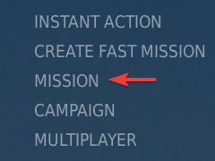
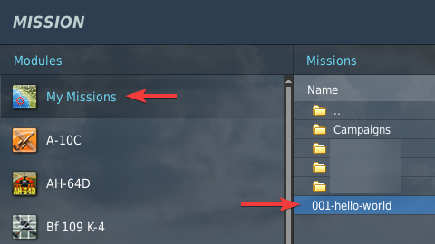
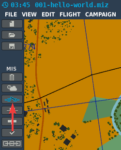
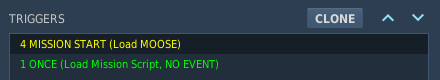
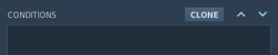
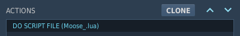
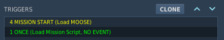
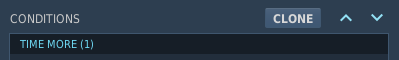
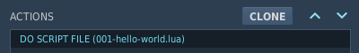

# Hello world mission
{: .no_toc }

1. Table of contents
{:toc}

## Let's see MOOSE in action

It is tradition that the first piece of code is a very simple example on showing
a "Hello world!" to the user. We have prepared this example mission for you. So
you can download and run it. Later on we will analyze it to explain the basics
on how to add MOOSE to your own missions.

- Download the demo mission [001-hello-world.miz] by clicking on the link.
- Put the .miz file into your Missions subfolder of your [Saved Games folder].
- Start DCS, choose `MISSION` in the menu on the right side:

    

- Click on `My Missions`, choose the `hello-world` mission and click on `OK`.

    

- It is an empty mission, so skip `BRIEFING` with `START` and then `FLY`.
- You spawn as a spectator. After some seconds you will see this message in
  the upper right corner:

    

Ok, that's all. There is nothing more to see in this mission. This is not
particularly impressive and can also be achieved using standard Lua in DCS
(i.e. without MOOSE), but we want to keep it simple at the beginning.

{: .note }
> If the text don't show up, the mission might be corrupted. Please contact the
> team on Discord for futher instructions.

## Let's take a look under the hood

- Go back to the main window and open the `MISSION EDITOR`.
- Choose `open mission` navigate to `My Missions` and open 001-hello-world.miz.
- On the left side activate `TRIGGERS`:

    

- On the right side the `TRIGGERS` dialog opens with a lot of options.
- First take a look at the available triggers:

    

- You will see two:
  - One in yellow with type `4 MISSION START` and name `Load MOOSE` and
  - one in green with type `1 ONCE` and name `Load Mission Script`.

### Execution of Moose

- Click on the yellow one to show all of it options.

- In the middle part the `CONDITIONS` will be shown.
  For this trigger there are no conditions configured.

    

    {: .important }
    > The trigger type `4 MISSION START` does not support `CONDITIONS`. <br />
    > So `CONDITIONS` must left blank when using it. <br />
    > **If you add a condition the trigger will never be executed!**

- On the right side the `ACTIONS` will be shown:

    

- A `DO SCRIPT FILE` is configured, which executes the file `Moose_.lua`

{: .highlight }
> This is the execution of the Moose framework included in the mission as one single file. <br />
> The difference between `Moose_.lua` and `Moose.lua` will be explained later. <br />
> This doesn't matter at this time.

{: .important }
> The trigger `4 MISSION START` will be executed **before** the mission is started! <br />
> This is important, because Moose **must** be executed before other scripts, that want to use Moose!

### Execution of the mission script

- Now move back to the left `TRIGGERS` area and click on the green trigger <br />
  `1 ONCE (Load Mission Script ...)`

    

- The configured options will be shown. <br />
  In the middle part the `CONDITIONS` will be shown. <br />
  For this trigger there is one condition configured:

    

- The combination of `1 ONCE` with `TIME MORE(1)` will ensure, that the mission
  script is executed 1 second after the mission is started.

- On the right side the `ACTIONS` will be shown:

    

- A `DO SCRIPT FILE` is configured, which executes the file `001-hello-world.lua`.

{: .highlight }
> This is the execution of the mission script, which you will create in the future.

{: .important }
> Most important is the fact, that the mission script (`001-hello-world.lua`)
> is executed **after** `Moose_.lua`, because the mission script needs the
> classes defined in `Moose_.lua`. And they are only available when `Moose_.lua`
> is executed before the mission script.

### Inspect the code of the mission script

The file `001-hello-world.lua` consists of following code:

```lua
--
-- Simple example mission to show the very basics of MOOSE
--
MESSAGE:New( "Hello World! This messages is printed by MOOSE", 35, "INFO" ):ToAll()
```

- The first three lines starting with `--` are comments and will be ignored.

- Line 4 is the one with the "magic":

  - With `MESSAGE` we use the class [Core.Message].
  
The part before the dot (Core) is the section where the class is placed.
It is important for the Moose programmes to have a structure where the classes
are placed. But in the code itself it is not used.

#### What is a class?

{: .highlight }
> In object-oriented programming, a class is an extensible program-code-template
> for creating objects, providing initial values for state (member variables)
> and implementations of behavior (member functions or methods). <br />
> *Source [Wikipedia:Class]{:target="_blank"}*

After the class name we call a method of that class. We do this with semicolon
followed by the name of the method and a pair of round brackets.
Here we call the method `New`, which creates a new MESSAGE object.

We give it three parameters within the round brackets, which are divided by commas:
1. The text we want to show: `"Hello World! ..."`
1. The time in seconds the messages should be visible: `35`
1. And the type of message: `"INFO"`

- With `New` the MESSAGE object is created, but the message is still not printed
  to the screen.
- This is done by `:ToAll()`. Another method of [Core.Message] which sends the
  message to all players, no matter if they belong to the RED or BLUE coalition.

If you you want to read more about [Core.Message] click on the link.
The page with all the Methods and Fields is very long and this might be
daunting, but for the copy and paste approach, you won't need it often.

And if you want to learn how to use more of that stuff, you will become
compftable in filtering these informations fast.

## Next step

Now it is time to [create your own Hello world] mission.

[Saved Games folder]: ../beginner/tipps-and-tricks.md#find-the-saved-games-folder
[001-hello-world.miz]: https://raw.githubusercontent.com/FlightControl-Master/MOOSE_MISSIONS/master/Core/Message/001-hello-world.miz
[Core.Message]: https://flightcontrol-master.github.io/MOOSE_DOCS_DEVELOP/Documentation/Core.Message.html
[Wikipedia:Class]: https://en.wikipedia.org/wiki/Class_(computer_programming)
[create your own Hello world]: hello-world-build.md
