# Functional classes guide

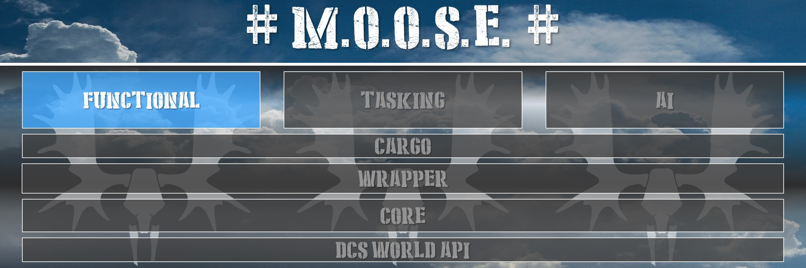

This chapter explains functional classes within MOOSE that allows you to enrich or enhance the functionality of your mission scenarios.

## 1. [ATC_GROUND]

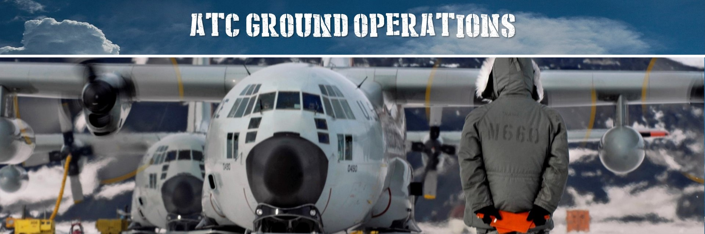

The ATC_GROUND classes monitor airbase traffic and regulate speed while taxiing.

**Features:**

  * Monitor speed of the airplanes of players during taxi.
  * Communicate ATC ground operations.
  * Kick speeding players during taxi.

## 2. [ARTY]

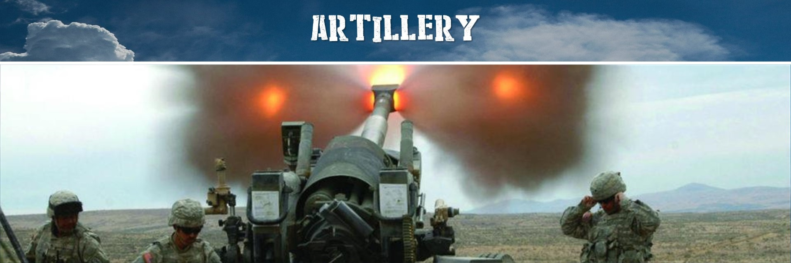

Easily assign and manage targets for artillery units using an advanced queueing system.

**Features:**

  * Multiple targets can be assigned. No restriction on number of targets.
  * Targets can be given a priority. Engagement of targets is executed a according to their priority.
  * Engagements can be scheduled, i.e. will be executed at a certain time of the day.
  * Multiple relocations of the group can be assigned and scheduled via queueing system.
  * Special weapon types can be selected for each attack, e.g. cruise missiles for Naval units.
  * Automatic rearming once the artillery is out of ammo (optional).
  * Automatic relocation after each firing engagement to prevent counter strikes (optional).
  * Automatic relocation movements to get the battery within firing range (optional).
  * Simulation of tactical nuclear shells as well as illumination and smoke shells.
  * New targets can be added during the mission, e.g. when they are detected by recon units.
  * Targets and relocations can be assigned by placing markers on the F10 map.
  * Finite state machine implementation. Mission designer can interact when certain events occur.
 

## 3. [CLEANUP]

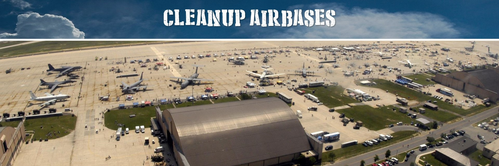

Keep an airbase clean of crashing or colliding airplanes.

**Features:**

  * Try to keep the airbase clean and operational.
  * Prevent airplanes from crashing.
  * Clean up obstructing airplanes from the runway that are standing still for a period of time.
  * Prevent airplanes firing missiles within the airbase zone.

## 4. [DESIGNATE]

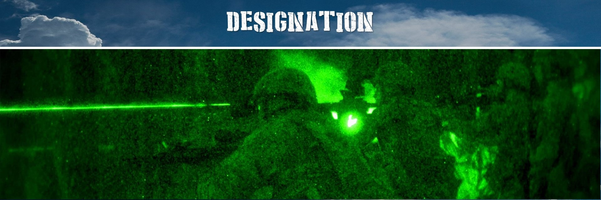

Orchestrate the designation of potential targets executed by a Recce group, 
and communicates these to a dedicated attacking group of players, 
so that following a dynamically generated menu system, 
each detected set of potential targets can be lased or smoked...

**Features:**

  * Faciliate the communication of detected targets to players.
  * Designate targets using lasers, through a menu system.
  * Designate targets using smoking, through a menu system.
  * Designate targets using illumination, through a menu system.
  * Auto lase targets.
  * Refresh detection upon specified time intervals.
  * Prioritization on threat levels.
  * Reporting system of threats.
  

## 5. [DETECTION]

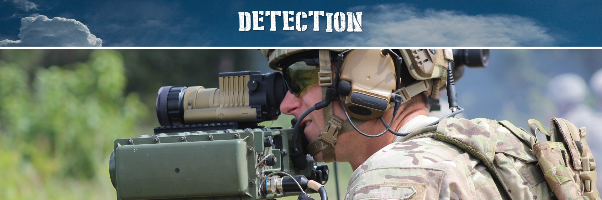

Facilitate the detection of enemy units within the battle zone executed by FACs (Forward Air Controllers) or Recces (Reconnassance Units). 
Detection uses the in-built detection capabilities of DCS World, but adds new functionalities.

**Features:**

  * Detection of targets by recce units.
  * Group detected targets per unit, type or area (zone).
  * Keep persistency of detected targets, if when detection is lost.
  * Provide an indication of detected targets.
  * Report detected targets.
  * Refresh detection upon specified time intervals.

## 6. [ESCORT]

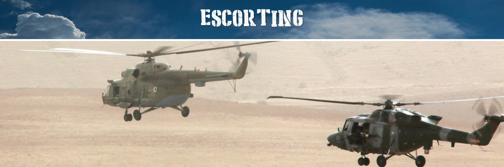

Allows you to interact with escorting AI on your flight and take the lead.
Each escorting group can be commanded with a whole set of radio commands (radio menu in your flight, and then F10).
The radio commands will vary according the category of the group. The richest set of commands are with Helicopters and AirPlanes.
Ships and Ground troops will have a more limited set, but they can provide support through the bombing of targets designated by the other escorts.

**Features:**

  * Escort navigation commands.
  * Escort hold at position commands.
  * Escorts reporting detected targets.
  * Escorts scanning targets in advance.
  * Escorts attacking specific targets.
  * Request assistance from other groups for attack.
  * Manage rule of engagement of escorts.
  * Manage the allowed evasion techniques of escorts.
  * Make escort to execute a defined mission or path.
  * Escort tactical situation reporting.
  

## 7. [MISSILE_TRAINER]

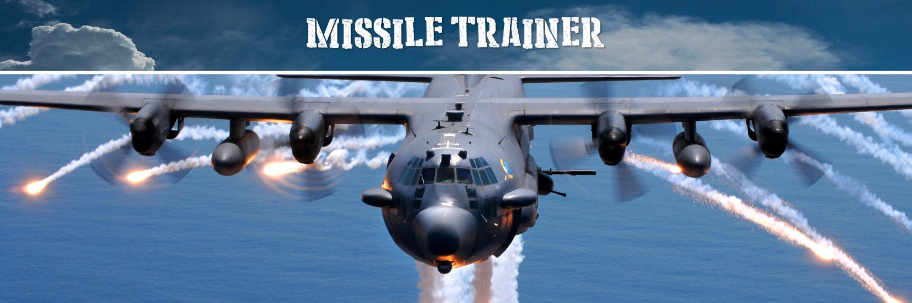

be alerted of any missiles fired, and when a missile would hit your aircraft, the class will destroy the missile within a certain range, 
to avoid damage to your aircraft. This is a training class for noob pilots, receiving training on missile evasion and detection techniques.

**Features:**

  * Track the missiles fired at you and other players, providing bearing and range information of the missiles towards the airplanes.
  * Provide alerts of missile launches, including detailed information of the units launching, including bearing, range
  * Provide alerts when a missile would have killed your aircraft.
  * Provide alerts when the missile self destructs.
  * Enable / Disable and Configure the Missile Trainer using the various menu options.

## 8. [RANGE]

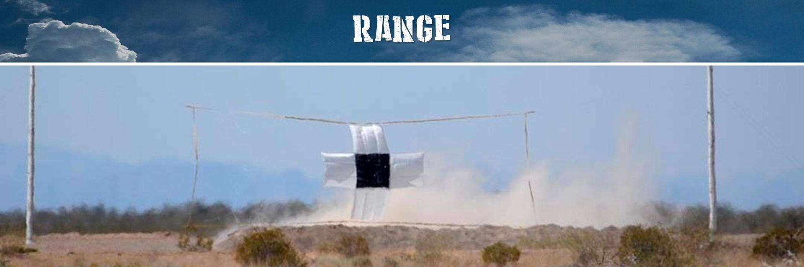

The RANGE class enables easy set up of bombing and strafing ranges within DCS World.
476th - Air Weapons Range Objects mod is highly recommended for this class.

**Features:**

  * Impact points of bombs, rockets and missils are recorded and distance to closest range target is measured and reported to the player.
  * Number of hits on strafing passes are counted and reported. Also the percentage of hits w.r.t fired shots is evaluated.
  * Results of all bombing and strafing runs are stored and top 10 results can be displayed.
  * Range targets can be marked by smoke.
  * Range can be illuminated by illumination bombs for night practices.
  * Bomb, rocket and missile impact points can be marked by smoke.
  * Direct hits on targets can trigger flares.
  * Smoke and flare colors can be adjusted for each player via radio menu.
  * Range information and weather report at the range can be reported via radio menu.

## 9. [RAT]

Fill the empty DCS world with randomized air traffic and bring more life to your airports.
In particular, it is designed to spawn AI air units at random airports. These units will be assigned a random flight path to another random airport on the map.
Even the mission designer will not know where aircraft will be spawned and which route they follow.

**Features:**

  * Very simple interface. Just one unit and two lines of Lua code needed to fill your map.
  * High degree of randomization. Aircraft will spawn at random airports, have random routes and random destinations.
  * Specific departure and/or destination airports can be chosen.
  * Departure and destination airports can be restricted by coalition.
  * Planes and helicopters supported. Helicopters can also be send to FARPs and ships.
  * Units can also be spawned in air within pre-defined zones of the map.
  * Aircraft will be removed when they arrive at their destination (or get stuck on the ground).
  * When a unit is removed a new unit with a different flight plan is respawned.
  * Aircraft can report their status during the route.
  * All of the above can be customized by the user if necessary.
  * All current (Caucasus, Nevada, Normandy, Persian Gulf) and future maps are supported.

## 10. [SCORING]

Administers the scoring of player achievements, and creates a CSV file logging the scoring events and results for use at team or squadron websites.
Automatically calculates the threat level of the objects hit and destroyed by players, which can be Wrapper.Unit, Static objects.
Positive score points are granted when enemy or neutral targets are destroyed. 
Negative score points or penalties are given when a friendly target is hit or destroyed. 
This brings a lot of dynamism in the scoring, where players need to take care to inflict damage on the right target. 
By default, penalties weight heavier in the scoring, to ensure that players don't commit fratricide. 
The total score of the player is calculated by adding the scores minus the penalties.

**Features:**

  * Set the scoring scales based on threat level.
  * Positive scores and negative scores.
  * A contribution model to score achievements.
  * Score goals.
  * Score specific achievements.
  * Score the hits and destroys of units.
  * Score the hits and destroys of statics.
  * Score the hits and destroys of scenery.
  * Log scores into a CSV file.
  * Connect to a remote server using JSON and IP.

## 11. [SEAD]

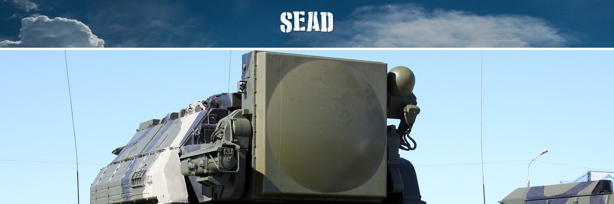

Provides defensive behaviour to a set of SAM sites within a running Mission.

**Features:**

  * When SAM sites are being fired upon, the SAMs will take evasive action will reposition themselves when possible.
  * When SAM sites are being fired upon, the SAMs will take defensive action by shutting down their radars.

## 12. [SUPPRESSION]

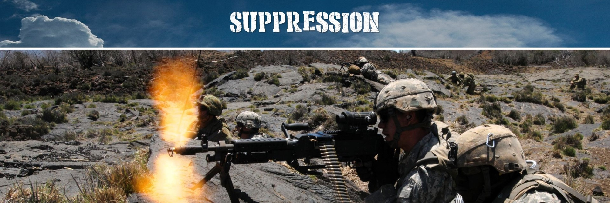

When ground units get hit by (suppressive) enemy fire, they will not be able to shoot back for a certain amount of time.
The implementation is based on an idea and script by MBot. See the DCS forum threat for details.
In addition to suppressing the fire, conditions can be specified which let the group retreat to a defined zone, move away from the attacker or hide at a nearby scenery object.

**Features:**

  * Hold fire of attacked units when being fired upon.

## 13. [WAREHOUSE]

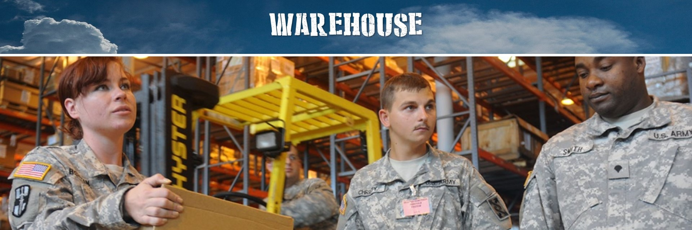

The warehouse concept simulates the organization and implementation of complex operations regarding the flow of assets between the point of origin 
and the point of consumption in order to meet requirements of a potential conflict. 
In particular, this class is concerned with maintaining army supply lines while disrupting those of the enemy, 
since an armed force without resources and transportation is defenseless.

**Features:**

  * Holds (virtual) assests in stock and spawns them upon request.
  * Manages requests of assets from other warehouses.
  * Queueing system with optional priorization of requests.
  * Realistic transportation of assets between warehouses.
  * Different means of automatic transportation (planes, helicopters, APCs, self propelled).
  * Strategic components such as capturing, defending and destroying warehouses and their associated infrastructure.
  * Intelligent spawning of aircraft on airports (only if enough parking spots are available).
  * Possibility to hook into events and customize actions.
  * Can be easily interfaced to other MOOSE classes.

## 14. [ZONE_CAPTURE_COALITION]

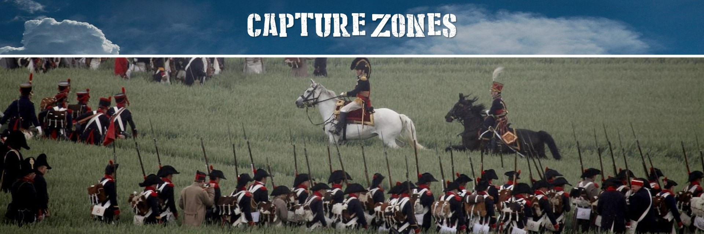

A very powerful class to models the process to zone guarding, attacking and capturing.

**Features:**

  * Models the possible state transitions between the Guarded, Attacked, Empty and Captured states.
  * A zone has an owning coalition, that means that at a specific point in time, a zone can be owned by the red or blue coalition.
  * Provide event handlers to tailor the actions when a zone changes coalition or state.

[ATC_GROUND]: https://flightcontrol-master.github.io/MOOSE_DOCS_DEVELOP/Documentation/Functional.ATC_Ground.html
[ARTY]: https://flightcontrol-master.github.io/MOOSE_DOCS_DEVELOP/Documentation/Functional.Artillery.html
[CLEANUP]: https://flightcontrol-master.github.io/MOOSE_DOCS_DEVELOP/Documentation/Functional.CleanUp.html
[DESIGNATE]: https://flightcontrol-master.github.io/MOOSE_DOCS_DEVELOP/Documentation/Functional.Designate.html
[DETECTION]: https://flightcontrol-master.github.io/MOOSE_DOCS_DEVELOP/Documentation/Functional.Detection.html
[ESCORT]: https://flightcontrol-master.github.io/MOOSE_DOCS_DEVELOP/Documentation/Functional.Escort.html
[MISSILE_TRAINER]: https://flightcontrol-master.github.io/MOOSE_DOCS_DEVELOP/Documentation/Functional.MissileTrainer.html
[RANGE]: https://flightcontrol-master.github.io/MOOSE_DOCS_DEVELOP/Documentation/Functional.Range.html
[RAT]: https://flightcontrol-master.github.io/MOOSE_DOCS_DEVELOP/Documentation/Functional.RAT.html
[SCORING]: https://flightcontrol-master.github.io/MOOSE_DOCS_DEVELOP/Documentation/Functional.Scoring.html
[SEAD]: https://flightcontrol-master.github.io/MOOSE_DOCS_DEVELOP/Documentation/Functional.Sead.html
[SUPPRESSION]: https://flightcontrol-master.github.io/MOOSE_DOCS_DEVELOP/Documentation/Functional.Suppression.html
[WAREHOUSE]: https://flightcontrol-master.github.io/MOOSE_DOCS_DEVELOP/Documentation/Functional.Warehouse.html
[ZONE_CAPTURE_COALITION]: https://flightcontrol-master.github.io/MOOSE_DOCS_DEVELOP/Documentation/Functional.ZoneCaptureCoalition.html
